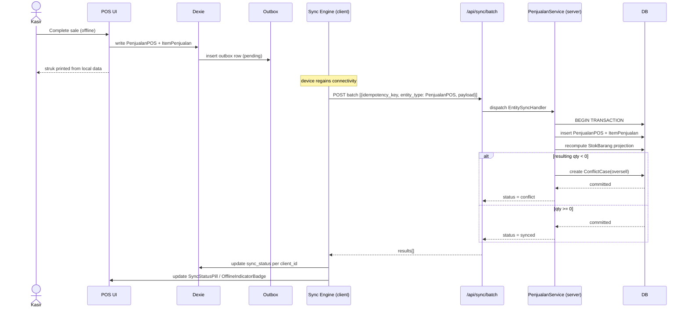
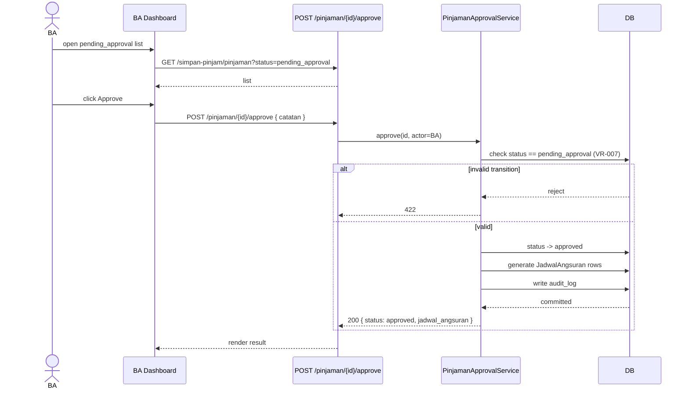
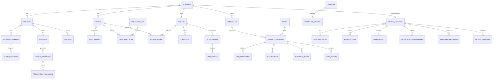
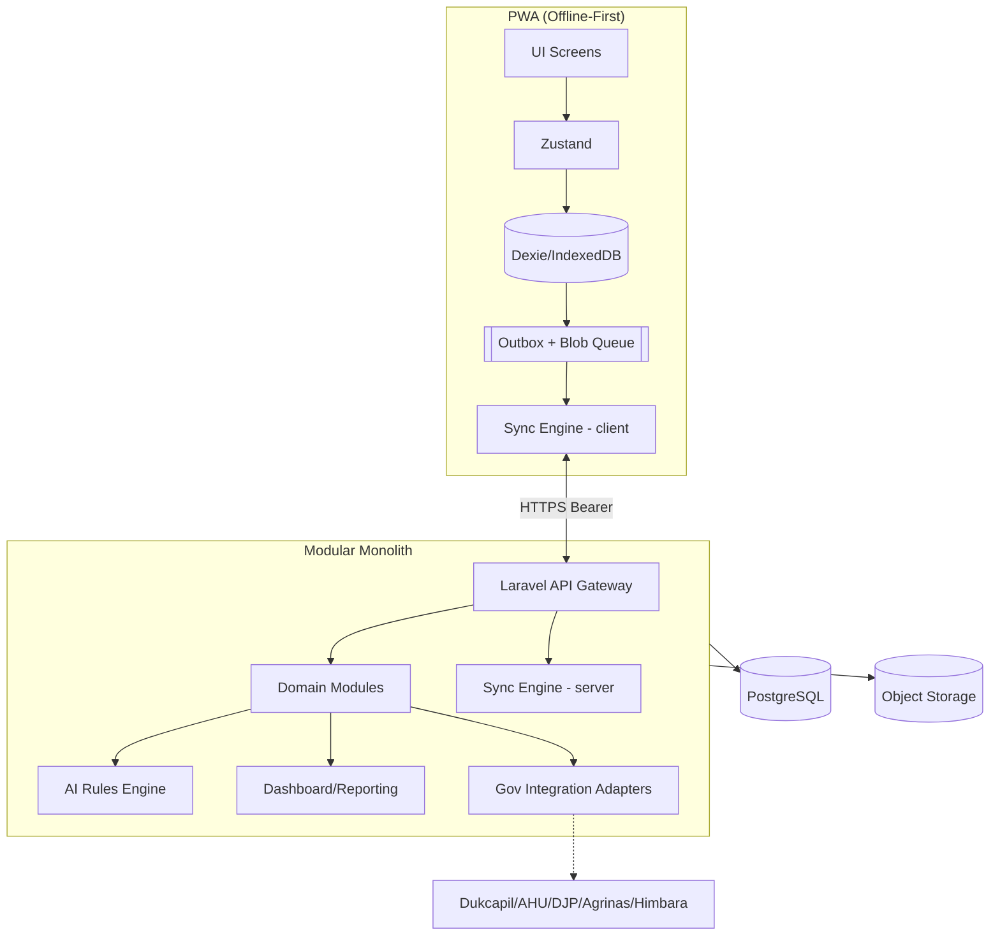
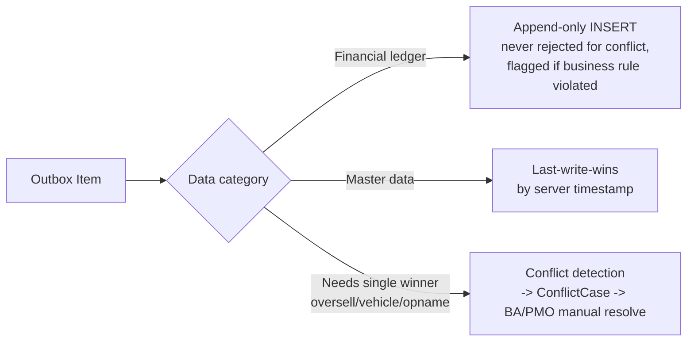
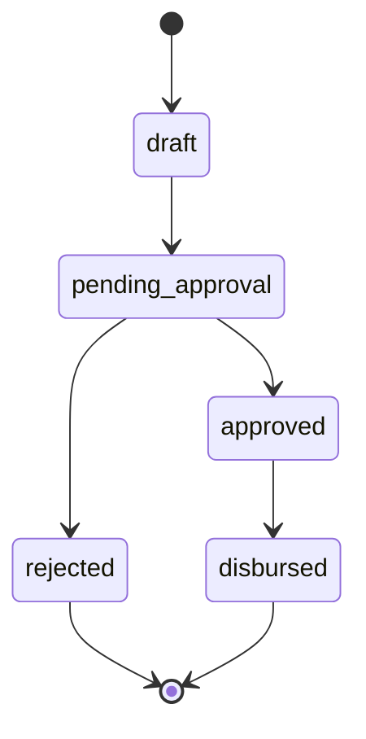
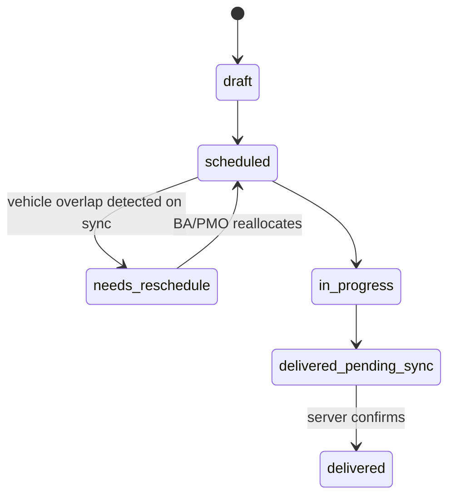
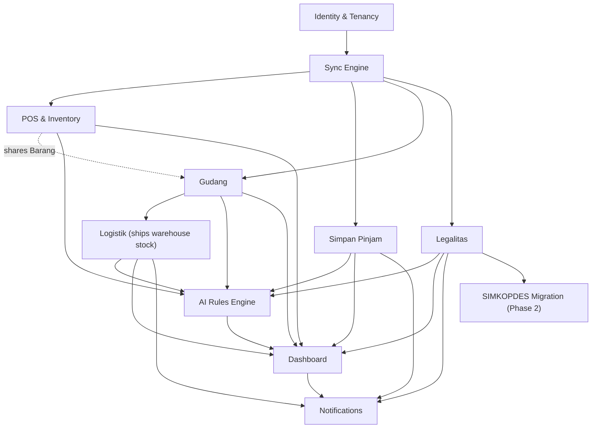

<!-- @format -->

# KOPET — AI Implementation Blueprint

**Role:** Lead Software Architect deliverable, derived from `KOPET_PRD_new.md`
**Purpose:** Translate the PRD into an implementation-ready blueprint that an AI coding agent (Claude Code / Cursor / Windsurf / Copilot) can execute phase-by-phase with minimal ambiguity.
**Stack locked in from PRD:** Client = Offline-first PWA (React + Dexie/IndexedDB + Zustand + TanStack Query). Server = Laravel modular monolith (Sanctum auth, Queue, `spatie/laravel-permission`). Sync = generic `entity_type/operation_type/payload` batch contract.

> Every open question flagged `ASSUMPTION` in the PRD is carried into this blueprint as an explicit **decision** so implementation isn't blocked. These are marked `🔶 DECISION (needs PO confirmation)` and are safe defaults chosen for buildability, not final business truth.

---

## 1. System Architecture

```
┌─────────────────────────────── DEVICE (per Kasir/Petugas/Sopir/Pengurus) ───────────────────────────────┐
│  React PWA (Vite, Workbox service worker)                                                                │
│  ┌───────────────┐   ┌────────────────┐   ┌───────────────┐   ┌───────────────────────────────────────┐ │
│  │ UI Screens     │──▶│ Zustand Store   │──▶│ Dexie (IndexedDB)│──▶│ Outbox Table (pending mutations)   │ │
│  │ (per module)   │◀──│ (session, conn) │◀──│ source of truth │◀──│ + Blob Queue (photos/signatures)   │ │
│  └───────────────┘   └────────────────┘   └───────────────┘   └───────────────────────────────────────┘ │
│         ▲                                                                        │                       │
│         │                                          TanStack Query (server cache) │                       │
└─────────┼────────────────────────────────────────────────────────────────────────┼───────────────────────┘
          │                                                                        ▼
          │                                              Sync Engine (client half): batches outbox,
          │                                              retry+backoff, idempotency_key per item
          │                                                                        │
          │                              HTTPS (Bearer token, per user+device)     │
          ▼                                                                        ▼
┌───────────────────────────────────── SERVER — Laravel Modular Monolith ──────────────────────────────────┐
│  API Layer (Sanctum, RBAC via spatie/laravel-permission)                                                  │
│  ┌───────────────┐ ┌───────────────┐ ┌───────────────┐ ┌───────────────┐ ┌────────────────────────────┐ │
│  │ POS/Inventory │ │ SimpanPinjam  │ │ Gudang        │ │ Logistik      │ │ Legalitas & Gov Integration │ │
│  │ Module        │ │ Module        │ │ Module        │ │ Module        │ │ Module                     │ │
│  └───────────────┘ └───────────────┘ └───────────────┘ └───────────────┘ └────────────────────────────┘ │
│         ▲                  ▲                 ▲                 ▲                     ▲                  │
│         └──────────────────┴─────────────────┴─────────────────┴─────────────────────┘                  │
│                                    Sync Engine (server half)                                              │
│                     - idempotency ledger  - conflict detection  - per-batch-item DB transaction           │
│  ┌───────────────────────────┐  ┌─────────────────────────┐  ┌────────────────────────────────────────┐ │
│  │ AI Rules Engine (batch)   │  │ Dashboard/Reporting      │  │ External Gov Integrations              │ │
│  │ produces rule_set JSON    │  │ (multi-tenant aggregate) │  │ Dukcapil / AHU / DJP / Agrinas / Himbara│ │
│  └───────────────────────────┘  └─────────────────────────┘  └────────────────────────────────────────┘ │
│                                    Queue Workers (file upload, retry to gov APIs, notifications)          │
└─────────────────────────────────────────────────────────────────────────────────────────────────────────┘
                                              │
                                              ▼
                                   PostgreSQL/MySQL (multi-tenant via koperasi_id)
                                   + Object storage (S3-compatible) for photos/signatures/docs
```

**Key architectural decisions:**

- 🔶 DECISION: Single database, multi-tenant via `koperasi_id` column on every tenant-scoped table (not DB-per-koperasi) — simpler ops for a competition MVP, revisit at national scale.
- Modular monolith on the server: each domain module is a self-contained Laravel package-like folder (routes, controllers, models, services, repositories) with **no cross-module direct model queries** — cross-module reads go through a Service/Facade so modules can be split into services later without a rewrite.
- Client writes **always** go: UI → Zustand action → Dexie write → Outbox row. Nothing calls the API directly from a component.
- Ledger pattern (append-only) enforced at both client (no `update`/`delete` repository methods exposed) and server (DB trigger/constraint denying UPDATE/DELETE on ledger tables) as defense in depth.

---

## 2. Folder Structure

```
kopet/
├── apps/
│   ├── client/                          # React PWA
│   │   ├── public/
│   │   ├── src/
│   │   │   ├── app/                     # App shell, router, providers
│   │   │   ├── modules/
│   │   │   │   ├── pos/
│   │   │   │   │   ├── components/
│   │   │   │   │   ├── screens/
│   │   │   │   │   ├── hooks/
│   │   │   │   │   ├── dexie/           # module-scoped Dexie table defs
│   │   │   │   │   ├── store/           # Zustand slice
│   │   │   │   │   └── rules/           # local rule evaluators (stok menipis, dsb.)
│   │   │   │   ├── simpan-pinjam/
│   │   │   │   ├── gudang/
│   │   │   │   ├── logistik/
│   │   │   │   ├── legalitas/
│   │   │   │   └── dashboard/           # BA/PMO/Dinas views
│   │   │   ├── shared/
│   │   │   │   ├── components/          # OfflineIndicatorBadge, ConflictReviewCard, LedgerBalanceDisplay
│   │   │   │   ├── sync/                # Sync Engine client half (outbox drainer, retry/backoff)
│   │   │   │   ├── dexie/               # Dexie DB instance, schema version, migrations
│   │   │   │   ├── auth/                # token storage, device_id generation
│   │   │   │   └── api/                 # typed API client (fetch wrapper)
│   │   │   └── types/                   # shared TS types mirrored from server DTOs
│   │   └── vite.config.ts
│   └── server/                          # Laravel
│       └── app/
│           ├── Modules/
│           │   ├── POS/
│           │   │   ├── Http/Controllers/
│           │   │   ├── Models/
│           │   │   ├── Repositories/
│           │   │   ├── Services/
│           │   │   ├── Rules/           # validation rule objects
│           │   │   └── Events/Listeners/
│           │   ├── SimpanPinjam/
│           │   ├── Gudang/
│           │   ├── Logistik/
│           │   ├── Legalitas/
│           │   ├── Identity/            # User, Role, Koperasi, Anggota, device auth
│           │   ├── Sync/                # generic batch handler, idempotency ledger, conflict resolvers
│           │   ├── RulesEngine/         # AI rule set generator + versioning
│           │   └── Dashboard/           # cross-module read models/aggregates
│           ├── Integrations/            # Dukcapil, AHU, DJP, Agrinas, Bank Himbara clients
│           ├── Http/Middleware/         # RBAC, rate limiting, device auth
│           └── Console/Commands/        # rule-set regeneration, overdue-approval sweep
│       ├── database/
│       │   ├── migrations/
│       │   └── seeders/
│       ├── routes/
│       │   └── api.php                 # grouped by module prefix
│       └── tests/
│           ├── Unit/
│           ├── Feature/
│           └── Sync/                    # dedicated sync-engine test suite
├── packages/
│   └── shared-types/                    # OpenAPI/JSON-schema → generated TS types, single source of truth
└── docs/
    ├── KOPET_PRD_new.md
    └── KOPET_Implementation_Blueprint.md
```

---

## 3. Domain-Driven Design Breakdown

| Bounded Context                                            | Core Aggregates                                                                                                                            | Ubiquitous Language                         | Notes                                                                                             |
| ---------------------------------------------------------- | ------------------------------------------------------------------------------------------------------------------------------------------ | ------------------------------------------- | ------------------------------------------------------------------------------------------------- |
| **Identity & Tenancy**                                     | `User`, `Role`, `Koperasi`, `Anggota`, `Device`                                                                                            | koperasi_id, role, device_id                | Shared kernel — every other context depends on it, nothing depends the other way                  |
| **POS & Inventory**                                        | `Barang` (AR root), `StokBarang`, `PenjualanPOS` (AR root, contains `ItemPenjualan`), `PembelianBarang`, `Supplier`                        | oversell, stok_minimum, ledger              | Stock qty is a _projection_ over ledger-like mutations, never overwritten                         |
| **Simpan Pinjam**                                          | `RekeningSimpanan` (AR root), `MutasiSimpanan`, `Deposito`, `Pinjaman` (AR root), `JadwalAngsuran`, `PembayaranAngsuran`                   | saldo, plafon, cicilan, append-only         | Strictest consistency domain — financial ledger, approval workflow                                |
| **Gudang**                                                 | `Gudang`, `LokasiRak`, `PenerimaanBarang`, `MutasiGudang` (AR root), `StokOpname` (AR root, contains `ItemOpname`)                         | selisih, opname, transfer                   | Eventual consistency across two devices (asal/tujuan) by design                                   |
| **Logistik**                                               | `Kendaraan`, `Sopir`, `JadwalPengiriman` (AR root), `ItemPengiriman`, `Appointment`, `TrackingPosisi`, `BuktiTerima`                       | needs_reschedule, overlap detection         | Conflict = two devices double-book a vehicle offline                                              |
| **Legalitas & Gov Integration**                            | `ProfilKoperasi` (AR root), `DokumenLegal`, `PotensiDesa`, `GeraiOutlet`, `PermohonanPembiayaan`, `VerifikasiEksternal`, `ArtikelKoperasi` | terverifikasi, hybrid, microsite            | Only context with external system integration (Dukcapil/AHU/DJP/Agrinas/Himbara)                  |
| **Sync Engine** (cross-cutting, its own context)           | `OutboxItem`, `IdempotencyRecord`, `ConflictCase`                                                                                          | idempotency_key, conflict_type, sync_status | Generic — knows _nothing_ about business meaning of payloads, only `entity_type`/`operation_type` |
| **AI Rules / Local Intelligence** (cross-cutting)          | `RuleSet`, `RuleVersion`                                                                                                                   | rule_id, condition, action, version         | Read-only consumer of other contexts' data; produces cached rule JSON                             |
| **Dashboard & Reporting** (cross-cutting, read-model only) | Aggregated projections, no own writes                                                                                                      | agregasi, drill-down                        | Built from read replicas/materialized views of other contexts, never the source of truth          |

**Context map relationships:**

- Identity & Tenancy → **Shared Kernel** for all.
- Sync Engine → **Conformist consumer** of each module's entity schema (via a registered "sync contract" per entity, not by reaching into module internals).
- Dashboard → **Anti-corruption layer** reads from all modules through published read-model queries, never writes.
- Legalitas → **Anti-corruption layer** around external gov APIs (adapter per system).

---

## 4. Modules

| #   | Module                      | Responsibility                                                                                           | Depends on                         |
| --- | --------------------------- | -------------------------------------------------------------------------------------------------------- | ---------------------------------- |
| M0  | Identity & Access           | Auth, RBAC, Koperasi/Anggota master, device registration                                                 | —                                  |
| M1  | Sync Engine                 | Batch ingestion, idempotency, conflict detection/escalation                                              | M0                                 |
| M2  | POS & Inventory             | Barang, stock, sales, purchasing, oversell handling                                                      | M0, M1                             |
| M3  | Simpan Pinjam               | Savings ledger, loans, approval workflow, installment schedule                                           | M0, M1                             |
| M4  | Gudang                      | Warehouse receiving, transfer, stock opname                                                              | M0, M1, M2 (shares `Barang`)       |
| M5  | Logistik                    | Vehicles, drivers, delivery schedules, proof of delivery, tracking                                       | M0, M1, M4 (ships warehouse stock) |
| M6  | Legalitas & Gov Integration | Cooperative profile, legal docs, village potential, financing requests, external verification, microsite | M0, M1                             |
| M7  | AI Rules Engine             | Server-side rule computation + versioned distribution                                                    | M2–M6 (read-only)                  |
| M8  | Dashboard & Reporting       | Role-based dashboards (BA/PMO/Dinas/Pengurus)                                                            | M1–M7 (read-only)                  |
| M9  | Notifications               | Conflict/approval/overdue alerts to dashboards                                                           | M1, M3, M5, M6                     |
| M10 | Migration (SIMKOPDES)       | Phase 2, but schema must accommodate from day 1                                                          | M6                                 |

---

## 5. Components

### Client — shared/reusable

- `OfflineIndicatorBadge` — connectivity + pending-sync count, present in every screen header.
- `ConflictReviewCard` — generic renderer for any `ConflictCase` (oversell, vehicle overlap, opname variance).
- `LedgerBalanceDisplay` — always computes balance client-side from cached ledger rows; never trusts a stored `saldo` column blindly.
- `SyncStatusPill` — per-record `pending/synced/conflict` chip used on list rows.
- `OutboxDrawer` — debug/ops view of the local outbox (useful for support + QA).
- `RoleGate` — wraps UI to hide actions the current role can't perform (mirrors server RBAC, never the sole enforcement).
- `FormAutosaveDraft` — for all "draft while offline" flows (ProfilKoperasi, PermohonanPembiayaan, DokumenLegal).
- `PhotoCaptureQueue` — captures + queues large blobs (QC photos, signatures) into the **separate** upload queue.

### Module-specific components (representative, not exhaustive)

- POS: `CashierCart`, `BarcodeScanInput`, `LowStockAlertBanner`, `OversellCaseDetail`.
- Simpan Pinjam: `SetoranTarikForm`, `AngsuranPaymentForm`, `LoanApprovalPanel` (BA-only, online-required), `InstallmentScheduleTable`.
- Gudang: `ReceivingForm+PhotoCapture`, `StockTransferForm`, `OpnameCountSheet`, `OpnameVarianceReviewPanel` (BA-only).
- Logistik: `DriverDailyManifest`, `SignatureCapturePad`, `VehicleScheduleBoard`, `RescheduleConflictBanner`.
- Legalitas: `ProfileDraftForm`, `LegalDocUploader`, `VillagePotentialForm`, `FinancingRequestWizard`, `PublicMicrosite` (public route, online-only).
- Dashboard: `KoperasiHealthTable` (PMO), `ConflictInbox` (BA), `ComplianceReadonlyView` (Dinas).

### Server components

- `SyncBatchController` → `SyncBatchService` → per-entity `EntitySyncHandler` (strategy pattern, one per `entity_type`).
- `ConflictResolver` interface with implementations: `OversellResolver`, `VehicleOverlapResolver`, `OpnameVarianceResolver`.
- `RuleSetBuilder` (scheduled job) → publishes versioned JSON consumed by `GET /api/rules/latest`.
- `ExternalVerificationGateway` interface with adapters: `DukcapilAdapter`, `AhuAdapter`, `DjpAdapter`, `AgrinasAdapter`, `HimbaraAdapter`.

---

## 6. Database Schema

All tables inherit the **sync metadata** columns (per PRD §13.0):
`client_id (ULID, PK)`, `sync_status enum(pending,synced,conflict)`, `created_at`, `updated_at`, `synced_at (nullable)`, `device_id`. 🔶 DECISION: ULID over UUIDv4, for index-friendly sortability on high-volume ledger tables.
All tenant-scoped tables additionally get `koperasi_id (FK, indexed)` — 🔶 DECISION resolving the PRD's open multi-tenancy question in favor of single-DB multi-tenant.
All tables get `deleted_at (nullable, soft delete)` except `TrackingPosisi` (hard-delete/rotated — high volume, low audit value) — 🔶 DECISION resolving PRD open question.

```sql
-- Identity & Tenancy
koperasi(id, nama, alamat, NIB, SKAHU, kedudukan_hukum, modal_simpanan_pokok, modal_simpanan_wajib, status[draft,terverifikasi], ...sync, ...soft_delete)
anggota(id, koperasi_id, nik, nama, status_keanggotaan, tanggal_bergabung, ...sync, ...soft_delete)
users(id, koperasi_id nullable[null for PMO/Dinas/BA-multi], nama, email, password_hash, ...soft_delete)
roles(id, name)            -- spatie/laravel-permission
model_has_roles(...)
devices(id, user_id, device_id, last_seen_at, platform)

-- POS & Inventory (M2)
barang(id, koperasi_id, kategori, nama, satuan, harga_beli, harga_jual, barcode UNIQUE NULLABLE, stok_minimum, ...sync)
supplier(id, koperasi_id, nama, kontak, alamat, ...sync)
stok_barang(id, barang_id FK, lokasi, qty, tanggal_update, ...sync)      -- materialized projection, see BR below
penjualan_pos(id, koperasi_id, kasir_id FK users, tanggal, total, metode_bayar, status[completed_local,synced,flagged_oversell,resolved], ...sync)
item_penjualan(id, penjualan_id FK, barang_id FK, qty, harga_satuan, subtotal)
pembelian_barang(id, koperasi_id, supplier_id FK, tanggal, total, status_bayar[belum_bayar,lunas,sebagian], ...sync)

-- Simpan Pinjam (M3) — ledger tables are INSERT-ONLY (DB trigger denies UPDATE/DELETE)
rekening_simpanan(id, anggota_id FK, jenis[pokok,wajib,sukarela], tanggal_buka, ...sync)      -- saldo is a VIEW, not a column
mutasi_simpanan(id, rekening_id FK, tipe[setor,tarik], jumlah, tanggal, petugas_id FK, no_kuitansi, UNIQUE(no_kuitansi, koperasi_id), ...sync)  -- APPEND ONLY
deposito(id, anggota_id FK, jumlah_pokok, tenor_bulan, bunga_persen, tanggal_mulai, status[aktif,jatuh_tempo,dicairkan], ...sync)
pinjaman(id, anggota_id FK, plafon, bunga_persen, tenor_bulan, tanggal_cair, status[draft,pending_approval,approved,rejected,disbursed], ...sync)
jadwal_angsuran(id, pinjaman_id FK, cicilan_ke, jatuh_tempo, jumlah_wajib, status[belum_bayar,lunas,terlambat])  -- server-generated, read-only client
pembayaran_angsuran(id, jadwal_id FK, jumlah_dibayar, tanggal_bayar, petugas_id FK, ...sync)  -- APPEND ONLY

-- Gudang (M4)
gudang(id, koperasi_id, nama, lokasi, kapasitas, ...sync)
lokasi_rak(id, gudang_id FK, kode_rak, kapasitas, UNIQUE(gudang_id, kode_rak), ...sync)
penerimaan_barang(id, gudang_id FK, barang_id FK, qty, foto_url nullable, tanggal, ...sync)
mutasi_gudang(id, barang_id FK, gudang_id FK, qty, tipe[masuk,keluar,transfer], gudang_tujuan FK nullable, tanggal, ...sync)  -- APPEND ONLY
stok_opname(id, gudang_id FK, tanggal, petugas_id FK, status[draft,pending_review,approved,rejected], ...sync)
item_opname(id, opname_id FK, barang_id FK, qty_sistem, qty_fisik, selisih)

-- Logistik (M5)
kendaraan(id, koperasi_id, plat_nomor UNIQUE, jenis, kapasitas_kg, status[aktif,maintenance,nonaktif], ...sync)
sopir(id, koperasi_id, nama, no_sim UNIQUE, status_aktif, ...sync)
jadwal_pengiriman(id, kendaraan_id FK, sopir_id FK, tanggal, asal, tujuan, status[draft,scheduled,needs_reschedule,in_progress,delivered_pending_sync,delivered], ...sync)
item_pengiriman(id, jadwal_id FK, barang_id FK, qty, referensi nullable)
appointment(id, jadwal_id FK, lokasi_tujuan, waktu_janji, kontak_penerima, status[scheduled,needs_reschedule,completed], ...sync)
tracking_posisi(id, jadwal_id FK, latitude, longitude, timestamp)          -- hard delete rotation, no soft delete
bukti_terima(id, jadwal_id FK, nama_penerima, tanda_tangan_url, waktu_terima, ...sync)

-- Legalitas & Gov Integration (M6)
profil_koperasi(id, nama, alamat, NIB UNIQUE NULLABLE, SKAHU UNIQUE NULLABLE, kedudukan_hukum, modal_simpanan_pokok, modal_simpanan_wajib, status[draft,terverifikasi], ...sync)
dokumen_legal(id, koperasi_id FK, jenis[akta,SKAHU,NPWP,berita_acara,NIB], file_url nullable, status_verifikasi[belum_diverifikasi,pending_verifikasi,terverifikasi,ditolak], ...sync)
potensi_desa(id, koperasi_id FK, komoditas, luas_area, volume nullable, jumlah_sdm nullable, estimasi_nilai_rp nullable, ...sync)
gerai_outlet(id, koperasi_id FK, nama, lokasi, status_aktif, foto nullable, ...sync)
permohonan_pembiayaan(id, koperasi_id FK, jenis[akun_bank,proposal_bisnis,pembiayaan], status[draft,submitted,in_review,approved,rejected], tanggal_ajuan nullable, ...sync)
verifikasi_eksternal(id, koperasi_id FK, jenis[NIK_dukcapil,NPAK_kemenkumham,pajak_djp,lahan_agrinas], status[pending_verifikasi,terverifikasi,ditolak], tanggal_verifikasi nullable, referensi_response JSON nullable)
artikel_koperasi(id, koperasi_id FK, judul, konten, tanggal_publish nullable, ...sync)

-- Cross-cutting
outbox(id, device_id, entity_type, operation_type, client_id, payload JSON, idempotency_key UNIQUE, status[pending,sent,synced,rejected,conflict], attempt_count, last_error, created_at)
idempotency_ledger(idempotency_key UNIQUE, processed_at, result_status)   -- server-side dedupe guard
conflict_case(id, conflict_type[oversell,vehicle_overlap,opname_variance], entity_refs JSON, status[open,resolved], resolution nullable, resolved_by FK users nullable, resolved_at nullable)
audit_log(id, actor_id, actor_role, entity_type, entity_id, action, before_value JSON, after_value JSON, timestamp)
rule_set(id, rule_id, condition, action, version, module, created_at)
notification(id, koperasi_id nullable, recipient_role, type, payload JSON, read_at nullable, created_at)
```

**Ledger invariant (enforced, not optional):** `mutasi_simpanan`, `pembayaran_angsuran`, `mutasi_gudang` get a DB-level `BEFORE UPDATE/DELETE` trigger raising an error. `StokBarang.qty` and `RekeningSimpanan.saldo` are either SQL views over their ledgers, or nightly-refreshed materialized projections with a reconciliation job — pick one explicitly in Milestone 1 (see §15).

---

## 7. API Endpoints

Base: `/api/*`, Bearer token (Sanctum) required unless noted. All list endpoints support `page`, `per_page`, and are `koperasi_id`-scoped automatically from the authenticated user's claims (except PMO/Dinas roles, which are cross-tenant read-only).

**Cross-cutting**

- `POST /api/sync/batch` — generic outbox push (per PRD §14.1).
- `GET /api/rules/latest?version={n}` — versioned rule set pull (§14.2).
- `GET /api/dashboard/pmo/koperasi` — PMO aggregate list (§14.5).
- `GET /api/conflicts` / `POST /api/conflicts/{id}/resolve` — BA/PMO conflict inbox.

**POS & Inventory** `/api/pos/*`

- `GET/POST /api/pos/barang` (create = online-required, unique barcode check)
- `GET /api/pos/stok?lokasi=`
- `GET /api/pos/penjualan/oversell` — flagged cases
- `POST /api/pos/penjualan/{id}/resolve-oversell`
- `GET/POST /api/pos/supplier`, `GET/POST /api/pos/pembelian`

**Simpan Pinjam** `/api/simpan-pinjam/*`

- `GET /api/simpan-pinjam/rekening/{anggota_id}`
- `GET /api/simpan-pinjam/pinjaman?status=pending_approval`
- `POST /api/pinjaman/{id}/approve` / `POST /api/pinjaman/{id}/reject` (role=BA, per §14.3/14.4)
- `GET /api/simpan-pinjam/jadwal-angsuran/{pinjaman_id}`
- `GET /api/simpan-pinjam/overdue-approvals` (PMO, US-SP-05)

**Gudang** `/api/gudang/*`

- `GET/POST /api/gudang/gudang`, `/rak`
- `GET /api/gudang/stok-opname?status=pending_review`
- `POST /api/gudang/stok-opname/{id}/approve` / `.../reject` (role=BA)

**Logistik** `/api/logistik/*`

- `GET/POST /api/logistik/kendaraan`, `/sopir`
- `GET/POST /api/logistik/jadwal-pengiriman`
- `GET /api/logistik/conflicts?status=needs_reschedule`
- `POST /api/logistik/jadwal-pengiriman/{id}/reschedule`

**Legalitas & Gov Integration** `/api/legalitas/*`

- `GET/POST /api/legalitas/profil-koperasi` (draft while offline; officially "final" only after sync)
- `POST /api/legalitas/dokumen` (file upload via queue), `GET /api/legalitas/dokumen?status_verifikasi=`
- `POST /api/legalitas/verifikasi/{jenis}` (§14.6, triggers external adapter)
- `GET/POST /api/legalitas/potensi-desa`, `/gerai-outlet`, `/artikel`
- `GET/POST /api/legalitas/permohonan-pembiayaan`, `POST .../{id}/submit`
- `GET /api/public/microsite/{koperasi_slug}` — **no auth**, online-required, public.

**Auth**

- `POST /api/auth/login` → `{ access_token, user, koperasi_id, role }`
- `POST /api/auth/device/register` → binds `device_id` to user
- `POST /api/auth/logout`

---

## 8. Repository Pattern

Server-side, one repository per aggregate root, interface-first so services never touch Eloquent directly:

```php
interface PinjamanRepositoryInterface {
    public function find(string $id): ?Pinjaman;
    public function findPendingApprovalOlderThan(int $days): Collection;
    public function create(array $data): Pinjaman;         // draft only
    public function transitionStatus(string $id, string $to, array $meta): Pinjaman; // enforces VR-007 state machine
    // NOTE: no update()/delete() for ledger-adjacent children (JadwalAngsuran, PembayaranAngsuran)
}

interface MutasiSimpananRepositoryInterface {
    public function append(array $data): MutasiSimpanan;   // INSERT only, no update/delete method exists at all
    public function balanceFor(string $rekeningId): Decimal; // SUM aggregation, never cached blindly
    public function existsByReceiptNumber(string $noKuitansi, string $koperasiId): bool; // VR-004
}

interface SyncOutboxRepositoryInterface {
    public function pushBatch(array $items): array;         // per-item DB transaction
    public function findByIdempotencyKey(string $key): ?IdempotencyRecord;
}
```

Rules:

- Repositories for append-only tables **physically expose no update/delete methods** — this is an interface-design guardrail against BR violations, not just a code review note.
- Every repository method that changes state runs inside `DB::transaction()`.
- Repositories return domain models/DTOs, never raw Eloquent query builders, so services stay storage-agnostic.

Client-side (Dexie) mirrors this: a `Repository` wrapper per table exposing `add()`, `getAll()`, `getById()`; ledger tables again expose no `update()`/`delete()`.

---

## 9. Service Layer

| Service                       | Responsibility                                                                                                                 |
| ----------------------------- | ------------------------------------------------------------------------------------------------------------------------------ |
| `PenjualanService`            | Create sale + items in one transaction; recompute stock projection; flag oversell if resulting qty < 0.                        |
| `StokProjectionService`       | Recomputes `stok_barang.qty` from `mutasi_gudang`/sales ledger; used by reconciliation job & on-demand.                        |
| `PinjamanApprovalService`     | Enforces VR-007 state machine, BR-009 (approval must be online + role BA), generates `JadwalAngsuran` on approval.             |
| `MutasiSimpananService`       | Validates `no_kuitansi` uniqueness server-side (VR-004), appends ledger row, never touches balance column.                     |
| `StokOpnameService`           | Computes `selisih`, applies threshold rule (VR-015) to decide `pending_review` vs auto-approve.                                |
| `JadwalPengirimanService`     | Detects vehicle/time overlap on sync, sets `needs_reschedule`, raises `ConflictCase`.                                          |
| `VerifikasiEksternalService`  | Orchestrates calls to `ExternalVerificationGateway` adapters, persists raw response for audit.                                 |
| `SyncBatchService`            | Iterates batch items, dispatches to per-entity `EntitySyncHandler`, wraps each in its own DB transaction, records idempotency. |
| `ConflictResolutionService`   | BA-facing resolution actions (oversell compensation, opname approve/reject, reschedule) + audit log write.                     |
| `RuleSetBuilderService`       | Scheduled job; computes rule conditions (e.g. `low_margin_alert`) from aggregated data, bumps `version`.                       |
| `DashboardAggregationService` | Builds read-model responses for PMO/BA/Dinas dashboards; no writes.                                                            |
| `NotificationService`         | Fan-out on conflict creation, loan overdue sweep, verification status change.                                                  |

Each service is injected with its repository interface(s) only — never a second service's repository directly, to keep bounded contexts honest.

---

## 10. State Management

| Layer                            | Tool                          | Contents                                                                                                                |
| -------------------------------- | ----------------------------- | ----------------------------------------------------------------------------------------------------------------------- |
| Global                           | Zustand                       | user session (role, koperasi_id), `navigator.onLine` status, global pending/conflict counters, current rule set version |
| Local (component)                | React `useState`/`useReducer` | form inputs, POS cart-before-confirm, dashboard filters                                                                 |
| Cached (offline source of truth) | Dexie/IndexedDB               | `Barang`, `StokBarang`, `RekeningSimpanan`, `JadwalAngsuran`, `JadwalPengiriman` (daily preload), rule set JSON         |
| Offline mutation queue           | Dexie `outbox` table          | every unsynced write, `sync_status: pending`                                                                            |
| Server cache/refetch             | TanStack Query                | read-through cache for online-required reads (e.g., dashboards, `rules/latest`), background refetch on reconnect        |

**Flow:** UI action → Zustand action (optimistic local state) → Dexie write (source of truth) → outbox row inserted → Sync Engine drains outbox when online → TanStack Query invalidates affected queries on successful sync → UI reflects `synced` status via `SyncStatusPill`.

🔶 DECISION (PRD open question): preloaded daily data (e.g. `JadwalPengiriman`) is considered stale after **24 hours** and triggers a forced background refresh attempt on next connectivity, without blocking offline use of the existing cache.

---

## 11. Authentication Flow

```
1. User opens app → checks Zustand/local storage for existing token
2. No token → Login screen (online-required) → POST /api/auth/login
     { email/username, password } → { access_token, user, role, koperasi_id }
3. First run on this device → POST /api/auth/device/register { device_id (generated UUID, persisted locally) }
     → server links device_id to user for audit trail (per record device_id field)
4. Token + device_id stored locally (secure storage / IndexedDB, NOT localStorage, and 🔶 encrypted at rest per §20)
5. Every API request → Authorization: Bearer {access_token}, X-Device-Id: {device_id}
6. Token expiry → refresh flow (🔶 DECISION: short-lived access token + refresh token, since offline sessions
   can be long; refresh attempted opportunistically when back online, silent re-auth)
7. Role fetched at login drives RoleGate on client (UX only) — server RE-CHECKS role on every request (RBAC is
   never client-trusted, per §20 Security Requirements)
8. Logout → revoke token server-side; local Dexie data is NOT wiped (offline data belongs to the device/koperasi,
   not the session) — 🔶 DECISION, needs PO confirmation re: shared-device scenarios
```

Server enforces RBAC via `spatie/laravel-permission` middleware per route group (`role:BA`, `role:PMO`, etc.), matching the Permission Matrix (PRD §17).

---

## 12. Sequence Diagrams

### 12.1 Offline POS Sale → Sync → Oversell Detection



### 12.2 Loan Approval (Online-Required, Role-Gated)



---

## 13. ERD



---

## 14. Mermaid Diagrams — Additional

### 14.1 High-Level Architecture



### 14.2 Sync Conflict Strategy by Data Sensitivity



### 14.3 Loan Status State Machine (VR-007)



### 14.4 Delivery Schedule State Machine



---

## 15. Development Milestones

| Milestone                            | Scope                                                                                                                             | Exit Criteria                                                                           |
| ------------------------------------ | --------------------------------------------------------------------------------------------------------------------------------- | --------------------------------------------------------------------------------------- |
| **M0 — Foundation**                  | Identity/Tenancy, Dexie schema, Sync Engine skeleton, idempotency, ledger DB triggers, CI/CD, seed data                           | A dummy entity can be created offline, queued, synced, and idempotency-deduped on retry |
| **M1 — POS & Inventory**             | Barang CRUD (online), POS offline sale flow, stock projection, oversell conflict case                                             | US-POS-01 to 04 acceptance criteria pass end-to-end                                     |
| **M2 — Simpan Pinjam**               | Ledger mutations, loan draft→approval→disbursement, installment schedule generation                                               | US-SP-01 to 05 pass; BR-009 (no offline final approval) provably enforced               |
| **M3 — Gudang**                      | Warehouse master data, receiving+photo queue, transfer eventual consistency, stok opname + threshold review                       | US-GD-01 to 04 pass                                                                     |
| **M4 — Logistik**                    | Vehicle/driver master, schedule creation offline, overlap conflict detection, proof of delivery, batch tracking                   | US-LOG-01 to 04 pass                                                                    |
| **M5 — Legalitas & Gov Integration** | Profile/doc draft flow, external verification adapters (stubbed until real contracts arrive), financing request, public microsite | US-LEG-01 to 06 pass; adapters swappable behind interface                               |
| **M6 — AI Rules + Dashboards**       | Rule set builder/versioning, role-based dashboards (BA/PMO/Dinas/Pengurus), conflict inbox, overdue sweep                         | All dashboard screens (§11) render live data across modules                             |
| **M7 — Hardening**                   | Security review (encryption at rest, RBAC audit), performance/load test, offline soak test, SIMKOPDES migration schema readiness  | Meets §20/21/26 non-functional requirements                                             |

---

## 16. Task Breakdown (representative, per milestone)

**M0 — Foundation**

1. Scaffold monorepo (`apps/client`, `apps/server`, `packages/shared-types`).
2. Laravel: Sanctum auth, `spatie/laravel-permission` roles seed, `Koperasi`/`Anggota`/`User`/`Device` migrations.
3. Client: Dexie schema v1, Zustand store skeleton, service worker (Workbox) install.
4. `outbox` + `idempotency_ledger` tables; `POST /api/sync/batch` skeleton with per-item transaction wrapper.
5. DB triggers denying UPDATE/DELETE on designated ledger tables (add table names to a config list, don't hardcode per-table).
6. `OfflineIndicatorBadge`, `SyncStatusPill`, `RoleGate` shared components.
7. CI: lint/test pipelines for both apps; seed script for demo koperasi.

**M1 — POS & Inventory**

1. `Barang`/`Supplier` migrations + online-required create endpoint with unique barcode validation.
2. Dexie tables + repository wrappers (no update/delete on ledger-like `MutasiGudang`-equivalent here, but POS ledger is `ItemPenjualan`/sales, so scope stock projection instead).
3. POS cart UI → offline sale write path.
4. `StokProjectionService` (SUM aggregation) + scheduled reconciliation job.
5. `EntitySyncHandler` for `PenjualanPOS` incl. oversell detection → `ConflictCase`.
6. BA `OversellCaseDetail` + resolution action + audit log.
7. Local rule evaluator: low-stock alert (offline-capable).

**M2 — Simpan Pinjam**

1. `RekeningSimpanan`/`MutasiSimpanan` migrations + DB trigger + `no_kuitansi` uniqueness validation server-side.
2. `Pinjaman` state machine service (VR-007) + `JadwalAngsuran` generation on approval.
3. `POST /pinjaman/{id}/approve|reject` (role=BA, online-only enforced server-side even if client somehow queues it offline — reject with clear error).
4. `PembayaranAngsuran` append-only path + Dexie mirror.
5. PMO overdue-approval sweep (scheduled command + `GET /overdue-approvals`).

**M3 — Gudang**

1. `Gudang`/`LokasiRak` masters; `PenerimaanBarang` with separate photo upload queue (not blocking data sync).
2. `MutasiGudang` append-only ledger + transfer eventual-consistency test (asal/tujuan order-independence).
3. `StokOpname`/`ItemOpname` + threshold rule (VR-015, configurable, not hardcoded) → `pending_review` routing.
4. BA opname approval screen + stock update on approve, no-op on reject.

**M4 — Logistik**

1. `Kendaraan`/`Sopir` masters.
2. `JadwalPengiriman` offline creation + overlap-detection sync handler → `needs_reschedule` + `ConflictCase`.
3. Daily preload query (§10 24h staleness) for driver manifest.
4. `SignatureCapturePad`/`PhotoCaptureQueue` for `BuktiTerima`.
5. Batch `TrackingPosisi` upload (5-min interval config), hard-delete rotation job.

**M5 — Legalitas & Gov Integration**

1. `ProfilKoperasi`/`DokumenLegal` draft-while-offline flow.
2. `ExternalVerificationGateway` interface + stub adapters per system (real contracts pending — §Missing Information item 18).
3. `PermohonanPembiayaan` draft→submit wizard.
4. Public microsite route (no auth, online-required, read-only aggregation).

**M6 — AI Rules + Dashboards**

1. `RuleSetBuilderService` scheduled job + `GET /rules/latest` versioning + client fallback-to-previous-version on corrupt cache.
2. Role-based dashboard read models (BA conflict inbox, PMO aggregate, Dinas read-only, Pengurus operational).
3. `NotificationService` fan-out wiring for conflicts/overdue/verification-status-change.

**M7 — Hardening**

1. Encryption at rest audit (server DB + Dexie client-side for NIK/financial fields).
2. Load test sync batch endpoint at expected device concurrency.
3. Offline soak test: multi-day offline device, large outbox drain.
4. Confirm SIMKOPDES migration mapping schema doesn't require entity redesign.

---

## 17. Feature Dependency Graph



**Reading this graph for build order:** Identity and Sync Engine are single points of dependency for everything — build once, correctly, first. POS and Gudang share the `Barang` entity, so POS should land before or alongside Gudang. Logistik depends on Gudang conceptually (ships stock) but not on its code, so it can be built in parallel by a second agent/session once Gudang's `Barang`/stock contracts are stable. Dashboards and Rules Engine are pure downstream consumers — build last, but design their read-model query contracts early so modules expose the right aggregation hooks from the start.

---

## 18. Suggested Git Branch Strategy

```
main                      (always deployable, protected, tagged per milestone release)
 └── develop               (integration branch, CI runs full suite on every merge)
      ├── feature/m0-foundation-auth
      ├── feature/m0-foundation-sync-engine
      ├── feature/m0-foundation-dexie-schema
      ├── feature/m1-pos-barang-crud
      ├── feature/m1-pos-offline-sale
      ├── feature/m1-pos-oversell-conflict
      ├── feature/m2-sp-ledger
      ├── feature/m2-sp-loan-approval
      ├── feature/m3-gudang-receiving
      ├── feature/m3-gudang-opname
      ├── feature/m4-logistik-schedule
      ├── feature/m4-logistik-conflict
      ├── feature/m5-legalitas-profile
      ├── feature/m5-legalitas-gov-adapters
      ├── feature/m6-rules-engine
      ├── feature/m6-dashboards
      └── hardening/m7-security-perf
```

Rules:

- One feature branch per **task**, not per module — keeps AI-agent PRs small and reviewable (each task in §16 ≈ one branch).
- Branch naming encodes milestone number so build order is visible in the branch list itself.
- No direct commits to `develop`/`main`; PR required, CI (lint + unit + feature tests) must pass.
- `hardening/*` branches only opened after all milestone branches for M0–M6 are merged.

---

## 19. Suggested Commit Order

Within each feature branch, commit granularity should mirror the dependency chain so a reviewer (or the next AI session) can bisect cleanly:

1. **Schema first** — migration + Dexie table definition in one commit ("add X table with sync metadata").
2. **Repository** — interface + implementation, no business logic ("add XRepository").
3. **Service** — business rules, validation, transactions ("add XService enforcing VR-00N/BR-0NN").
4. **API endpoint** — controller + route + form request validation ("expose POST /api/x").
5. **Sync handler** (if entity is sync-eligible) — `EntitySyncHandler` registration ("register X in sync batch dispatcher").
6. **Client repository/store wiring** — Dexie repo + Zustand slice ("wire X to client store").
7. **UI component/screen** — ("add X screen/component").
8. **Tests** — unit (service/repo), feature (API), and for M0/foundation-touching work, sync-specific tests — ("test X: happy path + conflict/edge case from PRD AC").
9. **Docs/OpenAPI update** if the endpoint contract changed.

This order means every commit leaves the branch in a compilable, testable state — important for AI agents that may be interrupted mid-task and resumed.

---

## 20. Prompt Plan for AI Coding Agents

Use one prompt per task from §16, scoped to one feature branch. Template:

```
Context: KOPET is an offline-first cooperative ERP. Client = React PWA + Dexie + Zustand + TanStack Query.
Server = Laravel modular monolith, Sanctum auth, spatie/laravel-permission RBAC.
Read docs/KOPET_PRD_new.md section [X] and docs/KOPET_Implementation_Blueprint.md section [Y] before starting.

Task: [one task from §16, e.g. "Implement MutasiSimpanan append-only ledger + no_kuitansi
server-side uniqueness validation (VR-004)"]

Constraints:
- This is an append-only ledger table: do NOT create update/delete repository methods or API routes for it.
- All writes go through [ServiceName]; no controller should touch the model directly.
- Add sync metadata columns (client_id ULID, sync_status, created_at, updated_at, synced_at, device_id)
  and koperasi_id tenant scoping to any new table.
- Follow the repository interface pattern in blueprint §8 exactly — define the interface first.
- Acceptance criteria to satisfy (copy exact Given/When/Then from PRD user story [US-XX-NN]).
- Write tests for the acceptance criteria above before/alongside implementation.

Deliverable: migration, model, repository interface + implementation, service, controller/route,
feature test covering the acceptance criteria, and a one-paragraph summary of what was built and
any assumption you had to make (flag it explicitly, don't silently decide).
```

**Sequencing rule for prompts:** never hand an agent a task from Milestone N+1 before Milestone N's foundation tasks (Identity, Sync Engine, ledger triggers) are merged to `develop` — those are load-bearing for every later prompt (idempotency keys, sync handler registration pattern, RBAC middleware all get reused verbatim).

**Recommended session structure for a single AI agent working solo through the whole project:**

1. One session per milestone (§15), not per task — keep the PRD + blueprint in context throughout that session so cross-task consistency (naming, ledger discipline) holds.
2. At the start of each new milestone session, prompt the agent to re-read §3 (DDD), §6 (schema), and the specific module's `OPEN QUESTIONS` block in the PRD, and to explicitly restate the 🔶 DECISIONs it's relying on.
3. End each milestone session by asking the agent to produce a short "what I assumed / what still needs product-owner confirmation" note — this becomes the changelog against the PRD's own "Missing Information" section.

---

## Build Order (dependency-minimized, AI-iteration-optimized)

The order below sequences work so that (a) nothing is built against an unstable contract, (b) each step is independently testable before the next starts, and (c) parallelizable branches are called out explicitly for a multi-agent setup.

1. **Identity & Tenancy** (users, roles, koperasi, anggota, device registration) — everything else references this.
2. **Sync Engine skeleton** (outbox schema, idempotency ledger, generic `EntitySyncHandler` dispatcher, per-item DB transaction wrapper) — built against a _dummy_ entity first so the contract is proven before any real business entity touches it.
3. **Ledger discipline infrastructure** (DB triggers denying UPDATE/DELETE on a configurable list of tables; client Dexie repository pattern that structurally omits update/delete for ledger tables) — must exist before any financial/stock entity is modeled, or those entities will accidentally get a mutable API.
4. **POS & Inventory** — simplest offline-first module (per the PRD's own implementation order), validates the whole client→Dexie→outbox→sync→conflict loop end-to-end on real business data. `Barang` becomes the shared master data other modules (Gudang, Logistik) will reference.
5. **Simpan Pinjam** — introduces the approval-workflow pattern (state machine + online-required enforcement) on top of the now-proven ledger infrastructure. Financially highest-risk domain; build once ledger and sync are solid, not before.
6. **Gudang** — introduces eventual-consistency-across-devices (transfer asal/tujuan) and the separated large-file (photo) upload queue pattern, both reused by Logistik next.
7. **Logistik** — reuses the photo-queue pattern from Gudang and introduces the "conflict = needs single winner" pattern (vehicle overlap) that's structurally identical to POS's oversell case — implement by adapting the `ConflictResolver` interface, not by writing new conflict machinery from scratch.
8. **Legalitas & Gov Integration** — deliberately last among domain modules: highest external-dependency risk (real Dukcapil/AHU/DJP/Agrinas/Himbara contracts are an open question in the PRD), so build it behind an adapter interface with stubs, and it can slip without blocking the offline-first core.
9. **AI Rules Engine + Dashboards + Notifications** — pure downstream read/aggregation layer; only buildable once M4–M8's data shapes are stable, but their _query contracts_ should be sketched during M4–M8 so each module exposes the right read hooks from day one.
10. **Hardening pass** (security/encryption audit, load/offline soak testing, SIMKOPDES migration-schema readiness check) — last, across the whole system.

**Parallelization note:** once step 3 is merged, Logistik's master data (Kendaraan/Sopir) and Legalitas's profile/document flow have no data dependency on POS or Simpan Pinjam and can be developed on separate branches by separate agent sessions concurrently with steps 4–6 — they only need to merge before step 9 (Dashboards) needs their data.
