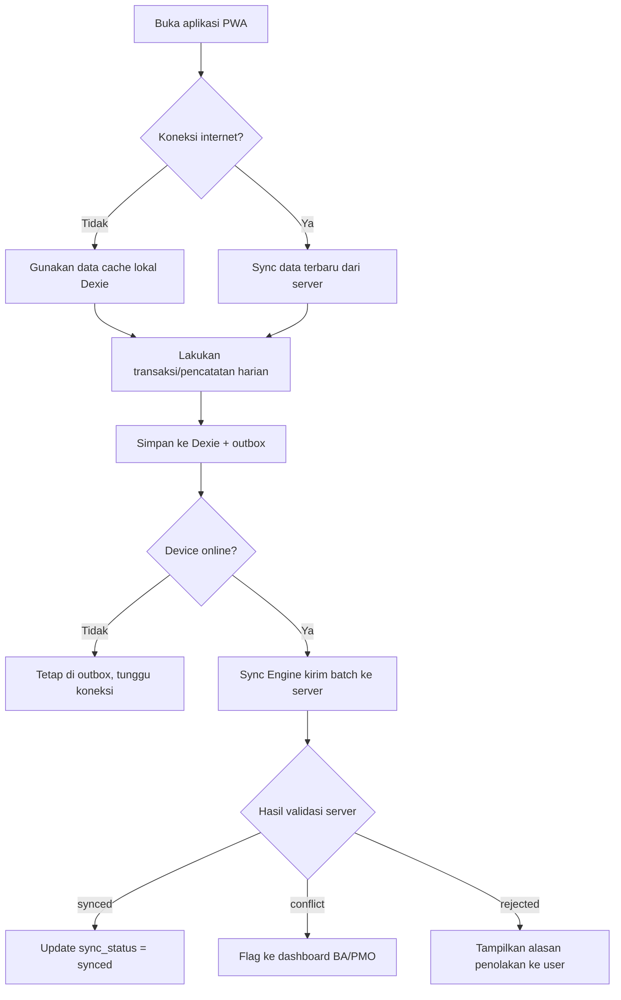
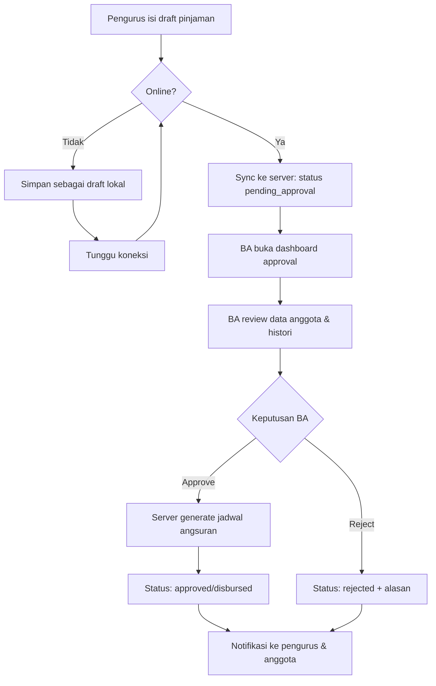
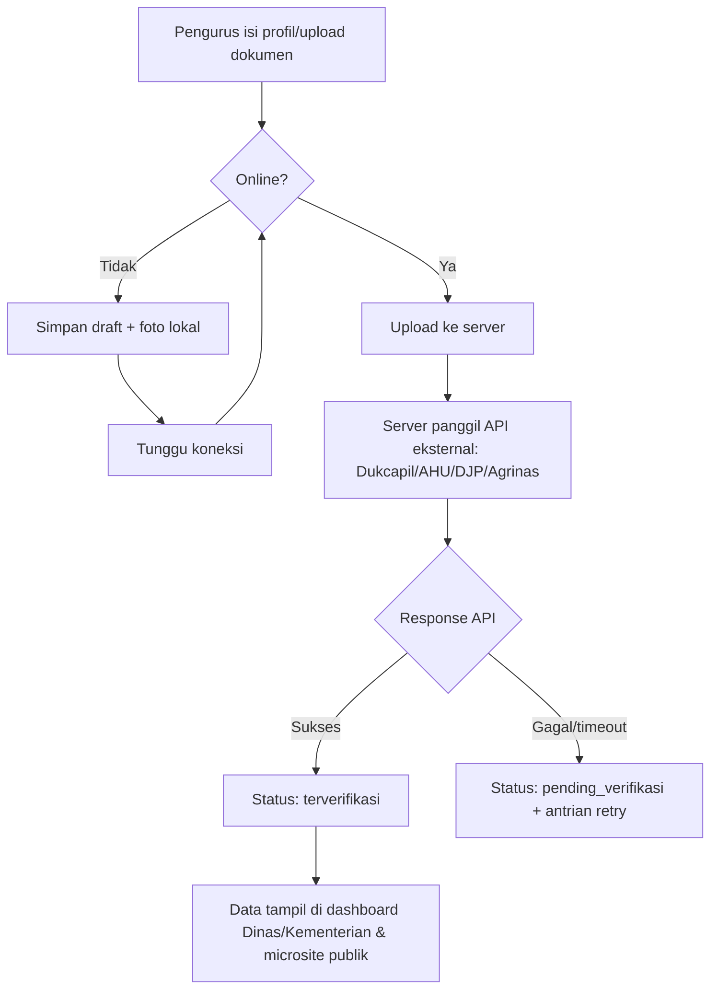

<!-- @format -->

# KOPET — Koperasi Terintegrasi

## AI-Ready Product Requirement Document

**Status:** Draft untuk kompetisi — siap diimplementasikan oleh AI coding assistant (Cursor / Claude Code / Windsurf / Copilot)
**Target Pengguna Produk:** Koperasi Desa/Kelurahan Merah Putih (KDKMP)

> **Catatan transformasi:** Setiap bagian yang ditandai `ASSUMPTION:` adalah interpretasi/penambahan teknis yang dibuat agar dokumen siap-implementasi, dan HARUS dikonfirmasi oleh product owner. Bagian yang tidak bisa diasumsikan dengan aman dikumpulkan di **OPEN QUESTIONS** per section dan di rekap akhir **Missing Information**.

---

# 1. Executive Summary

KOPET adalah platform ERP digital **offline-first** untuk Koperasi Desa/Kelurahan Merah Putih (KDKMP), dirancang sebagai pengganti SIMKOPDES — sistem yang sudah dipakai 92,69% KDKMP tapi sepenuhnya bergantung pada koneksi internet sehingga gagal optimal di wilayah blankspot (contoh: 216 dari 8.494 KDMP di Jawa Timur berada di blankspot, baru 10 koperasi berhasil update microsite).

KOPET mengintegrasikan seluruh fungsi SIMKOPDES (profil & legalitas koperasi, dokumen, potensi desa, permohonan pembiayaan, integrasi data pemerintah) ditambah empat unit usaha operasional yang lebih dalam: toko sembako (POS), simpan pinjam, gudang, dan logistik — dalam satu ekosistem data yang tetap berfungsi penuh tanpa internet untuk aktivitas harian.

Arsitekturnya membagi fitur secara eksplisit menjadi offline-first (transaksi harian bervolume tinggi), online-required (keputusan bernilai tinggi/governance/verifikasi pemerintah eksternal), dan hybrid. Sinkronisasi menggunakan strategi berbeda per sensitivitas data (ledger append-only untuk data finansial, last-write-wins untuk data master, deteksi konflik manual untuk data yang butuh satu pemenang pasti). AI/analitik dijalankan di server dan di-cache ke client sebagai rule set ringan, bukan inferensi live.

---

# 2. Problem Statement

## 2.1 Masalah Saat Ini

- SIMKOPDES adalah sistem wajib nasional (mandat Inpres No. 9/2025 dan No. 17/2025) yang **sepenuhnya cloud/web-based**, sehingga tidak bisa diakses/diperbarui saat perangkat/lokasi koperasi tidak memiliki koneksi internet stabil.
- Data kuantitatif: dari 8.494 KDMP di Jawa Timur, 216 koperasi berada di area blankspot, dan baru 10 koperasi yang berhasil memperbarui data microsite mereka.
- Di luar cakupan SIMKOPDES (POS, gudang, logistik), koperasi di wilayah dengan konektivitas terbatas masih bergantung pada pencatatan manual (Excel/kertas).

## 2.2 Siapa yang Mengalami

| Pihak Terdampak                                                  | Dampak Spesifik                                                                             |
| ---------------------------------------------------------------- | ------------------------------------------------------------------------------------------- |
| Pengurus koperasi di area blankspot                              | Tidak bisa update profil/legalitas/microsite; proses manual berulang                        |
| Anggota koperasi                                                 | Tidak ada visibilitas real-time atas simpanan/pinjaman/transaksi                            |
| Kasir toko sembako, petugas simpan pinjam, petugas gudang, sopir | Pencatatan manual di kertas/Excel, rawan hilang/salah, sulit direkonsiliasi                 |
| Business Assistant (BA) & PMO                                    | Data terfragmentasi antar koperasi, sulit diawasi & sulit mengambil keputusan berbasis data |
| Dinas/Kementerian Koperasi                                       | Kesulitan memverifikasi status legalitas & kepatuhan pelaporan koperasi di blankspot        |

## 2.3 Mengapa Ini Penting

- SIMKOPDES adalah mandat presiden — kegagalan adopsi berarti koperasi kehilangan akses ke program pemerintah (pembiayaan, verifikasi legalitas, integrasi Bank Himbara).
- Operasional harian yang tidak tercatat digital menyebabkan data terfragmentasi, sulit diawasi, dan lambat dalam pengambilan keputusan bisnis.

## 2.4 Solusi Eksisting dan Kekurangannya

| Solusi Eksisting                 | Kekurangan                                                                                      |
| -------------------------------- | ----------------------------------------------------------------------------------------------- |
| SIMKOPDES (cloud/web-based)      | Tidak berfungsi tanpa internet; gagal diadopsi optimal di blankspot                             |
| Pencatatan manual (Excel/kertas) | Data terfragmentasi, tidak real-time, rawan human error, sulit direkonsiliasi lintas unit usaha |

## OPEN QUESTIONS — Problem Statement

- Berapa persentase KDKMP secara nasional (bukan hanya Jatim) yang berada di area blankspot atau under-served connectivity? Data ini penting untuk sizing target pasar Fase 1.
- Apakah ada data kuantitatif tentang dampak finansial dari pencatatan manual (mis. kerugian akibat selisih stok/kas) yang sudah dikumpulkan?

---

# 3. Product Vision

KOPET memposisikan diri sebagai **fondasi data (data layer)** bagi ekosistem digital koperasi desa di Indonesia: satu sumber kebenaran (single source of truth) yang tetap dapat dioperasikan sepenuhnya offline untuk kebutuhan harian, namun tetap terhubung dan patuh terhadap ekosistem integrasi pemerintah yang sudah dibangun SIMKOPDES (Dukcapil, Kemenkumham/AHU, DJP, Agrinas, Bank Himbara).

Visi jangka panjang (di luar MVP, lihat Bagian 30 Roadmap Fase 3–5): KOPET menjadi prasyarat data bersih dan real-time yang memungkinkan fitur AI business matching (mempertemukan koperasi dengan buyer/offtaker) dan agregasi potensi desa nasional bekerja secara akurat — sesuatu yang tidak mungkin dilakukan di atas data yang buruk/terfragmentasi seperti kondisi saat ini.

---

# 4. Goals

Goals terukur (measurable), diturunkan dari Bagian 2 PRD asli:

| ID   | Goal                                                                | Metrik Keberhasilan                                                       | Target (ASSUMPTION)                                                                          |
| ---- | ------------------------------------------------------------------- | ------------------------------------------------------------------------- | -------------------------------------------------------------------------------------------- |
| G-01 | Menghilangkan ketergantungan pada pencatatan manual                 | % transaksi tercatat digital vs manual                                    | `ASSUMPTION:` ≥95% transaksi tercatat digital dalam 3 bulan pasca-onboarding                 |
| G-02 | Menjamin kontinuitas operasional tanpa internet                     | Uptime fungsional device saat offline                                     | 100% fitur inti (offline-first) tersedia tanpa internet                                      |
| G-03 | Meningkatkan transparansi ke BA/PMO                                 | Waktu rata-rata data sampai ke dashboard pusat setelah online             | `ASSUMPTION:` ≤5 menit setelah device online & sync berhasil                                 |
| G-04 | Mendukung pengambilan keputusan berbasis data                       | Jumlah insight/alert yang ditindaklanjuti BA per bulan                    | `ASSUMPTION:` baseline diukur di bulan 1, target peningkatan ditentukan setelah baseline ada |
| G-05 | Menggantikan SIMKOPDES tanpa memutus akses program pemerintah       | % koperasi bermigrasi tanpa kehilangan status verifikasi/akses pembiayaan | 100% (non-negotiable — kegagalan berarti risiko legal/bisnis bagi koperasi)                  |
| G-06 | Menjangkau koperasi di area blankspot yang gagal diadopsi SIMKOPDES | % koperasi blankspot yang aktif memakai KOPET                             | `ASSUMPTION:` target pilot 216 koperasi blankspot Jatim sebagai proof-of-concept (Bagian 11) |

## OPEN QUESTIONS — Goals

- Target numerik pasti untuk G-01, G-03, G-04 belum ditentukan oleh product owner — angka di atas adalah `ASSUMPTION` sementara untuk keperluan perencanaan sprint/QA, bukan komitmen bisnis.

---

# 5. Non-Goals

Berdasarkan Bagian 3.2 PRD asli — hal-hal yang **secara eksplisit tidak termasuk** dalam scope produk saat ini:

- **Business Matching Platform** (marketplace buyer/offtaker) — direncanakan Fase 3.
- **Village Potential Aggregator** lintas-desa (agregasi nasional) — direncanakan Fase 4.
- **Live GPS tracking real-time** — hanya batch position update berkala (mis. tiap 5 menit); bukan live tracking konstan.
- **Integrasi pembayaran digital pihak ketiga** — direncanakan Fase 5.
- **Proses pendirian badan hukum koperasi baru dari nol** (akta & pengesahan Kemenkumham) — KOPET hanya menangani profil koperasi yang **sudah berbadan hukum**. Pendirian baru tetap melalui jalur notaris/AHU eksternal yang berlaku, di luar sistem KOPET.

---

# 6. Target Users

`ASSUMPTION:` Detail motivasi/frustrasi/technical ability di bawah adalah elaborasi berbasis konteks user story pada PRD asli (Bagian 5), karena PRD asli belum eksplisit menulis persona dalam format ini. Product owner disarankan memvalidasi.

## 6.1 Kasir (Toko Sembako)

- **Deskripsi:** Petugas yang mengoperasikan kasir POS di outlet/gerai koperasi.
- **Motivasi:** Melayani pembeli secepat mungkin, mencatat transaksi dengan akurat.
- **Frustrasi:** Sinyal internet tidak stabil menghambat transaksi bila sistem bergantung pada koneksi.
- **Kemampuan teknis:** `ASSUMPTION:` dasar–menengah, terbiasa memakai HP/tablet Android sederhana.
- **Tugas utama:** Scan/input barang, terima pembayaran, cetak struk, laporkan stok menipis.

## 6.2 Petugas Lapangan (Simpan Pinjam)

- **Deskripsi:** Petugas yang mengunjungi anggota untuk mencatat setoran/tarikan simpanan dan pembayaran angsuran.
- **Motivasi:** Mencatat transaksi langsung di lokasi anggota tanpa menunda ke kantor.
- **Frustrasi:** Lokasi kunjungan sering tanpa sinyal.
- **Kemampuan teknis:** `ASSUMPTION:` dasar, mobile-first.
- **Tugas utama:** Catat mutasi simpanan, catat pembayaran angsuran, ajukan draft pinjaman.

## 6.3 Petugas Gudang

- **Deskripsi:** Mengelola penerimaan, penyimpanan, transfer, dan stok opname barang skala besar.
- **Motivasi:** Data stok akurat dan real-time untuk distribusi ke toko/buyer.
- **Frustrasi:** Foto bukti QC besar memblokir sinkronisasi data transaksi penting bila tidak dipisah.
- **Kemampuan teknis:** `ASSUMPTION:` dasar–menengah.
- **Tugas utama:** Terima barang + foto QC, transfer stok antar gudang/toko, stok opname.

## 6.4 Sopir & Koordinator Logistik

- **Deskripsi:** Sopir mengantar barang sesuai jadwal; koordinator menyusun jadwal dan alokasi kendaraan.
- **Motivasi:** Jadwal jelas meski tanpa sinyal di jalan; bukti serah terima tercatat cepat.
- **Frustrasi:** Bentrok alokasi kendaraan antar device saat offline.
- **Kemampuan teknis:** `ASSUMPTION:` dasar.
- **Tugas utama (sopir):** Lihat jadwal preload, kumpulkan tanda tangan/foto bukti terima, update posisi berkala.
- **Tugas utama (koordinator):** Buat jadwal/appointment, alokasikan kendaraan/sopir.

## 6.5 Pengurus Koperasi

- **Deskripsi:** Pengelola operasional & administratif koperasi di tingkat desa/kelurahan.
- **Motivasi:** Operasional lancar, legalitas & profil koperasi up-to-date, akses ke program pembiayaan pemerintah.
- **Frustrasi:** SIMKOPDES sulit diakses di area blankspot; input data legalitas berulang antar sistem.
- **Kemampuan teknis:** `ASSUMPTION:` dasar–menengah, sudah terbiasa dengan alur SIMKOPDES (perlu UI yang familiar untuk mengurangi resistensi adopsi — lihat Bagian 28 Risiko).
- **Tugas utama:** Kelola profil/legalitas koperasi, daftarkan produk/supplier/gudang/kendaraan baru, ajukan permohonan pembiayaan, kelola gerai/outlet, tulis artikel CMS.

## 6.6 Anggota Koperasi

- **Deskripsi:** Anggota yang memiliki simpanan/pinjaman dan bertransaksi di toko koperasi.
- **Motivasi:** Transparansi atas riwayat transaksi, saldo, dan jadwal angsuran pribadi.
- **Frustrasi:** `ASSUMPTION:` tidak ada visibilitas real-time atas status keuangan mereka di koperasi.
- **Kemampuan teknis:** `ASSUMPTION:` bervariasi luas (dasar hingga tidak familiar teknologi) — UI harus sangat sederhana.
- **Tugas utama:** Lihat riwayat transaksi pribadi, saldo simpanan, jadwal angsuran.

## 6.7 Business Assistant (BA)

- **Deskripsi:** Mendampingi & mengawasi beberapa koperasi sekaligus.
- **Motivasi:** Resolusi konflik data cepat, approval yang aman, kelengkapan dokumen legal koperasi binaannya.
- **Frustrasi:** Data konflik/oversell yang butuh keputusan manual bisa menumpuk bila tidak ada alert jelas.
- **Kemampuan teknis:** `ASSUMPTION:` menengah, pengguna dashboard web.
- **Tugas utama:** Monitoring multi-koperasi, resolusi konflik sync, approval pinjaman besar & koreksi stok opname besar, verifikasi dokumen legal.

## 6.8 Project Management Office (PMO)

- **Deskripsi:** Mengawasi performa dan kesehatan sistem lintas-koperasi secara agregat.
- **Motivasi:** Visibilitas progres migrasi SIMKOPDES, tren performa wilayah, kesehatan sistem.
- **Kemampuan teknis:** `ASSUMPTION:` menengah–tinggi, pengguna dashboard analitik.
- **Tugas utama:** Agregasi lintas-koperasi, monitoring status `sync_status: pending`, progres migrasi.

## 6.9 Dinas/Kementerian Koperasi

- **Deskripsi:** Regulator yang membutuhkan data koperasi terverifikasi untuk pengawasan & kepatuhan.
- **Motivasi:** Data legalitas dan kepatuhan pelaporan yang akurat, setara dengan fungsi dashboard nasional SIMKOPDES.
- **Kemampuan teknis:** `ASSUMPTION:` menengah, pengguna dashboard read-only.
- **Tugas utama:** Melihat data NIK/NPAK/pajak/lahan terverifikasi, status legalitas & kepatuhan.

---

# 7. User Stories

Semua user story di bawah diambil langsung dari PRD asli (Bagian 5.1-5.5) dan dilengkapi Acceptance Criteria eksplisit format Given/When/Then agar siap dikonversi menjadi test case.

## 7.1 Modul Toko Sembako (POS + Inventory)

### US-POS-01

As a kasir, I want tetap bisa memproses transaksi penjualan dan mencetak struk meski tidak ada sinyal internet, so that pelayanan ke pembeli tidak terhambat.

Acceptance Criteria:

- Given kasir sedang offline, When kasir menyelesaikan transaksi POS, Then transaksi tersimpan ke Dexie dan struk tercetak dari data lokal tanpa error.
- Given transaksi tersimpan offline, When device kembali online, Then transaksi otomatis masuk antrian outbox untuk sync tanpa aksi manual kasir.
- Given 2 device menjual item stok terakhir yang sama saat offline (oversell), When keduanya sync, Then sistem TIDAK membatalkan otomatis salah satu transaksi, melainkan mem-flag kasus ke dashboard BA.

### US-POS-02

As a kasir, I want sistem memperingatkan saat stok barang menipis, so that saya bisa mengingatkan pengurus untuk restock sebelum kehabisan.

Acceptance Criteria:

- Given stok_barang.qty < barang.stok_minimum, When rule cache lokal dievaluasi, Then alert stok menipis muncul di UI kasir tanpa perlu koneksi internet.
- Given riwayat penjualan tersedia secara lokal, When rule cache mengevaluasi kecepatan jual historis, Then rekomendasi restock ditampilkan.

### US-POS-03

As a pengurus koperasi, I want mendaftarkan produk atau supplier baru melalui proses yang tervalidasi server, so that tidak terjadi duplikasi kode barang antar outlet/device.

Acceptance Criteria:

- Given pengurus sedang offline, When mencoba mendaftarkan produk baru, Then sistem menolak/menahan aksi dan menampilkan pesan bahwa fitur ini butuh koneksi internet (online-required).
- Given pengurus online dan submit produk baru, When server memvalidasi kode barang, Then server menolak jika kode barang sudah ada (unique constraint) dan mengembalikan error yang jelas.

### US-POS-04

As a BA, I want melihat kasus stok negatif (oversell) yang terjadi akibat transaksi offline bersamaan, so that saya bisa membantu pengurus menyelesaikannya dengan adil.

Acceptance Criteria:

- Given dua transaksi offline menyebabkan stok < 0 setelah sync, When sync selesai, Then kasus oversell muncul di dashboard BA dengan detail kedua transaksi terkait.
- Given kasus oversell di-flag, When BA memilih resolusi (retur/kompensasi), Then status kasus berubah dan tercatat sebagai audit log.

## 7.2 Modul Simpan Pinjam

### US-SP-01

As a petugas lapangan, I want mencatat setoran atau pembayaran angsuran anggota langsung di lokasi tanpa sinyal, so that saya tidak perlu menunda pencatatan sampai kembali ke kantor.

Acceptance Criteria:

- Given petugas offline, When mencatat mutasi simpanan/angsuran, Then data tersimpan ke Dexie sebagai entri ledger append-only (tidak overwrite saldo).
- Given mutasi memiliki nomor kuitansi fisik, When sync, Then server memvalidasi keunikan nomor kuitansi untuk mendeteksi duplikasi pencatatan.

### US-SP-02

As an anggota koperasi, I want melihat jadwal angsuran dan status jatuh tempo saya kapan saja, so that saya bisa mempersiapkan pembayaran tepat waktu.

Acceptance Criteria:

- Given jadwal angsuran sudah di-precompute server dan di-push ke client, When anggota membuka aplikasi offline, Then jadwal & status jatuh tempo tetap terlihat dari cache lokal.
- Given jatuh tempo H-3, When rule cache dievaluasi, Then notifikasi jatuh tempo muncul tanpa koneksi internet.

### US-SP-03

As a pengurus koperasi, I want mengajukan pinjaman anggota sebagai draft meski sedang offline, so that proses tidak tertunda hanya karena sinyal.

Acceptance Criteria:

- Given pengurus offline, When submit pengajuan pinjaman, Then data tersimpan lokal dengan status draft dan TIDAK dianggap final.
- Given draft pinjaman tersimpan, When device online dan sync berhasil, Then status berubah menjadi pending_approval.

### US-SP-04

As a Business Assistant (BA), I want approval pinjaman dengan plafon besar hanya bisa final setelah saya meninjau data tersinkron, so that tidak ada pencairan dana yang tidak diawasi.

Acceptance Criteria:

- Given pinjaman berstatus pending_approval dengan plafon di atas threshold (ASSUMPTION: threshold ditentukan per koperasi/kebijakan, lihat Open Questions), When BA meninjau, Then hanya BA yang dapat mengubah status menjadi approved atau rejected.
- Given approval dilakukan offline (tidak mungkin secara desain), Then sistem tidak menyediakan aksi approval di UI mode offline sama sekali.

### US-SP-05

As a PMO, I want melihat daftar pengajuan pinjaman yang masih berstatus "pending approval", so that saya bisa memastikan tidak ada yang tertahan terlalu lama.

Acceptance Criteria:

- Given ada pinjaman berstatus pending_approval lebih dari N hari (ASSUMPTION: N=7 hari, perlu konfirmasi), When PMO membuka dashboard, Then daftar pinjaman overdue-approval ditampilkan dengan indikator visual.

## 7.3 Modul Gudang

### US-GD-01

As a petugas gudang, I want mencatat penerimaan barang beserta foto kondisinya langsung saat barang datang, meski gudang berada di lokasi tanpa sinyal, so that tidak ada penundaan pencatatan.

Acceptance Criteria:

- Given petugas offline, When submit penerimaan barang + foto, Then data teks tersimpan ke outbox transaksi utama, dan foto disimpan sebagai blob lokal di antrian upload terpisah.
- Given foto berukuran besar, When sync berjalan, Then antrian foto TIDAK memblokir sync data transaksi.

### US-GD-02

As a petugas gudang, I want melakukan transfer stok ke gudang/toko lain secara offline, so that operasional distribusi tidak terhenti karena koneksi.

Acceptance Criteria:

- Given transfer dicatat offline di gudang asal, When gudang tujuan mencatat "diterima" sebelum gudang asal ter-sync "dikirim", Then sistem tetap menerima kedua entri (eventual consistency).

### US-GD-03

As a petugas gudang, I want melakukan stok opname dan mencatat selisih stok sistem vs fisik, so that data stok tetap akurat dari waktu ke waktu.

Acceptance Criteria:

- Given stok opname dicatat, When selisih di bawah threshold signifikan, Then entri diterima sebagai koreksi resmi tanpa perlu approval BA.
- Given selisih di atas threshold signifikan (ASSUMPTION: perlu didefinisikan nilai/persentase threshold), When sync, Then entri berstatus pending_review hingga disetujui BA.

### US-GD-04

As a BA, I want meninjau dan menyetujui koreksi stok opname yang selisihnya besar/mencurigakan, so that potensi kebocoran atau kesalahan bisa terdeteksi sebelum menjadi catatan resmi.

Acceptance Criteria:

- Given stok opname berstatus pending_review, When BA menyetujui, Then MutasiGudang resmi tercatat dan stok ter-update; When BA menolak, Then entri ditandai rejected dan stok sistem tidak berubah.

## 7.4 Modul Logistik

### US-LOG-01

As a sopir, I want melihat seluruh jadwal pengiriman dan appointment hari ini yang sudah dimuat sebelum berangkat, so that saya tetap tahu tujuan meski tidak ada sinyal di jalan.

Acceptance Criteria:

- Given jadwal hari berjalan sudah di-preload saat batch sync pagi, When sopir membuka aplikasi offline sepanjang hari, Then seluruh jadwal & appointment tetap terlihat lengkap.

### US-LOG-02

As a sopir, I want mengumpulkan tanda tangan dan foto bukti terima langsung di lokasi pengiriman, so that proses serah terima tidak tertunda menunggu sinyal.

Acceptance Criteria:

- Given bukti terima dikumpulkan offline, When disimpan, Then status pengiriman menjadi delivered_pending_sync sampai server mengonfirmasi.

### US-LOG-03

As a koordinator logistik, I want membuat jadwal pengiriman baru meski sedang offline, dengan pemberitahuan jika kendaraan yang sama sudah dialokasikan device lain, so that saya bisa menjadwalkan ulang dengan cepat.

Acceptance Criteria:

- Given 2 device menjadwalkan kendaraan yang sama pada waktu yang sama secara offline, When keduanya sync, Then sistem mendeteksi konflik alokasi kendaraan dan menandai kedua jadwal sebagai needs_reschedule, dieskalasi ke BA/PMO.

### US-LOG-04

As a BA/PMO, I want melihat notifikasi appointment yang bentrok alokasi kendaraannya, so that saya bisa membantu realokasi secara manual.

Acceptance Criteria:

- Given jadwal berstatus needs_reschedule, When BA/PMO membuka dashboard, Then notifikasi & detail konflik ditampilkan untuk realokasi manual.

## 7.5 Modul Legalitas, Profil & Integrasi Pemerintah

### US-LEG-01

As a pengurus koperasi, I want mengisi profil dan data legal koperasi sebagai draft meski berada di lokasi dengan sinyal terbatas, so that saya tidak perlu menunggu koneksi stabil untuk memulai proses registrasi/pembaruan data.

Acceptance Criteria:

- Given pengurus offline, When mengisi form profil koperasi, Then data tersimpan lokal berstatus draft dan menjadi resmi hanya setelah tersinkron ke server.

### US-LEG-02

As a pengurus koperasi, I want memfoto dan mengunggah dokumen legal (akta, SKAHU, NPWP) langsung dari lapangan, so that proses verifikasi bisa langsung berjalan begitu perangkat kembali online.

Acceptance Criteria:

- Given foto dokumen diambil offline, When disimpan, Then dokumen berstatus status_verifikasi = belum_diverifikasi dan masuk antrian upload; status verifikasi hanya bisa berubah saat online.

### US-LEG-03

As a petugas survei/BA, I want mencatat data potensi desa (komoditas, luas lahan, jumlah SDM) langsung di lokasi tanpa sinyal, so that pendataan potensi desa tidak tertunda oleh keterbatasan jaringan.

Acceptance Criteria:

- Given petugas offline di lokasi survei, When submit data potensi desa, Then data tersimpan lokal lengkap dan disinkronkan otomatis saat online.

### US-LEG-04

As a pengurus koperasi, I want mengajukan permohonan pembiayaan ke Bank Himbara melalui platform yang sama dengan yang saya pakai untuk operasional harian, so that saya tidak perlu berpindah aplikasi atau mengulang input data.

Acceptance Criteria:

- Given pengurus mengisi draft proposal offline, When online, Then submit final terkirim ke endpoint permohonan pembiayaan dan status PermohonanPembiayaan berubah dari draft ke submitted.

### US-LEG-05

As Dinas Koperasi/Kementerian, I want melihat data koperasi yang sudah terverifikasi dengan Dukcapil dan Kemenkumham secara real-time di dashboard PMO, so that pengawasan dan audit lebih akurat dan cepat.

Acceptance Criteria:

- Given VerifikasiEksternal.status = terverifikasi, When Dinas/Kementerian membuka dashboard, Then data terverifikasi tersebut tampil dengan tanggal verifikasi dan referensi response API.

### US-LEG-06

As a calon mitra/investor, I want melihat microsite publik koperasi yang menampilkan legalitas, potensi desa, dan produk unggulan, so that saya bisa menilai kelayakan kemitraan tanpa perlu menghubungi pengurus secara langsung.

Acceptance Criteria:

- Given microsite adalah fitur online-required, When investor mengakses URL microsite, Then halaman menampilkan data profil, legalitas, potensi desa, dan artikel terpublikasi terbaru.

## OPEN QUESTIONS - User Stories

- Threshold nominal "plafon besar" untuk pinjaman yang mewajibkan approval BA belum didefinisikan (US-SP-04).
- Threshold persentase/nominal "selisih signifikan" pada stok opname yang memicu pending_review belum didefinisikan (US-GD-03).
- Definisi "terlalu lama" untuk SLA approval pinjaman PMO (US-SP-05) - nilai N=7 hari adalah ASSUMPTION sementara.

---

# 8. Functional Requirements

Setiap modul mengikuti struktur: Purpose, Inputs, Outputs, Business Rules, Validation, Edge Cases, Error Handling, Dependencies, Priority, Acceptance Criteria.

## 8.1 Modul Toko Sembako (POS + Inventory)

**Purpose:** Mendukung transaksi jual-beli harian di outlet koperasi dan pengelolaan stok barang dagangan, berfungsi penuh tanpa internet untuk operasi harian.

**Inputs:** Scan barcode via kamera device, input manual kode/nama barang, jumlah, metode pembayaran, data pembelian dari supplier.

**Outputs:** Transaksi `PenjualanPOS` + `ItemPenjualan`, struk cetak (thermal printer atau PDF), update ledger `StokBarang`, alert stok menipis.

**Business Rules:** Lihat BR-001 s.d. BR-006 (Bagian 15).

**Validation:**

- Barcode/kode barang harus ada di master `Barang` sebelum bisa dijual.
- `qty` penjualan harus > 0.
- `metode_bayar` harus salah satu dari enum yang didefinisikan (`ASSUMPTION:` tunai, transfer, dompet_digital — perlu konfirmasi metode yang didukung).

**Edge Cases:**

- Oversell akibat 2 device offline menjual stok terakhir yang sama → tidak auto-cancel, di-flag ke BA (US-POS-04).
- Kasir override harga jual offline → status draft, resmi setelah sync (fitur Hybrid).
- Barcode tidak terbaca kamera → fallback input manual kode barang.

**Error Handling:**

- Barang tidak ditemukan di database lokal → tampilkan pesan "barang tidak terdaftar, hubungi pengurus" (karena pendaftaran produk baru online-required).
- Printer thermal tidak terhubung → fallback tampilkan struk digital di layar / opsi cetak ulang setelah printer tersedia.

**Dependencies:** Sync Engine (Bagian 8.6), AI Cache/Local Rules Engine (Bagian 8.7) untuk alert stok & rekomendasi restock, modul Legalitas (untuk data supplier terdaftar).

**Priority:** P0 (MVP — Fase 1).

**Acceptance Criteria:** Lihat US-POS-01 s.d. US-POS-04.

## 8.2 Modul Simpan Pinjam

**Purpose:** Mengelola unit usaha keuangan koperasi — tabungan anggota, deposito berjangka, dan kredit/pinjaman — dengan jaminan integritas ledger untuk kebutuhan audit.

**Inputs:** Data setoran/tarikan simpanan, nomor kuitansi fisik, data pembayaran angsuran, data pengajuan pinjaman (plafon, tenor).

**Outputs:** `MutasiSimpanan`, `PembayaranAngsuran`, `Pinjaman` (draft/pending/approved), `JadwalAngsuran` (precomputed server-side).

**Business Rules:** BR-007 s.d. BR-012.

**Validation:**

- Nomor kuitansi fisik wajib unik per koperasi (dicek saat sync, bukan hanya di client).
- Jumlah setor/tarik harus > 0; tarikan tidak boleh membuat saldo negatif (`ASSUMPTION:` kecuali ada fitur overdraft yang belum disebutkan di PRD asli — perlu konfirmasi).
- Pengajuan pinjaman wajib memiliki `anggota_id` valid dan `plafon` > 0.

**Edge Cases:**

- Petugas offline berkepanjangan → banyak mutasi pending di outbox, berpotensi delay signifikan sebelum server melihat saldo terbaru (lihat Risiko R-01, Bagian 28).
- Approval pinjaman besar tidak boleh final offline dalam kondisi apa pun — tidak ada override.
- Bunga & jadwal angsuran dihitung server-side; jika device lama tidak sync, jadwal yang ditampilkan bisa usang sampai sync berikutnya.

**Error Handling:**

- Nomor kuitansi duplikat terdeteksi saat sync → item ditolak dengan status `rejected`, notifikasi ke petugas untuk verifikasi manual.
- Kalkulasi bunga gagal di server (mis. data pinjaman tidak lengkap) → jadwal angsuran tidak di-generate, status pinjaman tetap `pending_approval` dengan pesan error spesifik.

**Dependencies:** Sync Engine, AI Cache (notifikasi jatuh tempo, deteksi tren tunggakan, rekomendasi plafon), Dashboard BA (approval workflow).

**Priority:** P0 (MVP — Fase 1).

**Acceptance Criteria:** Lihat US-SP-01 s.d. US-SP-05.

## 8.3 Modul Gudang (Warehouse Management)

**Purpose:** Mengelola stok skala besar — penerimaan barang dari petani/produsen, penyimpanan, dan distribusi ke toko/buyer.

**Inputs:** Data penerimaan barang (no surat jalan, kondisi QC, foto), data transfer stok, data stok opname (qty fisik vs sistem).

**Outputs:** `PenerimaanBarang`, `MutasiGudang` (ledger), `StokOpname` + `ItemOpname`.

**Business Rules:** BR-013 s.d. BR-016.

**Validation:**

- Setiap `PenerimaanBarang` harus punya minimal 1 `ItemPenerimaan`.
- Kapasitas gudang/rak tidak boleh terlampaui tanpa peringatan (`ASSUMPTION:` hard limit vs soft warning perlu diklarifikasi).
- Selisih stok opname signifikan (`ASSUMPTION:` threshold TBD) memicu status `pending_review`.

**Edge Cases:**

- Transfer antar gudang dengan urutan pencatatan yang tidak sinkron (eventual consistency) — sistem tidak menolak, tapi UI harus menampilkan status transfer yang jelas (`in_transit` / `received` / `sent_pending_sync`).
- Foto QC besar tidak boleh memblokir sync data transaksi lain.

**Error Handling:**

- Upload foto gagal berulang kali → tetap simpan lokal, tampilkan indikator "menunggu upload" tanpa menghalangi transaksi lain.
- Stok opname dengan selisih di luar batas wajar → wajib `pending_review`, tidak bisa langsung menjadi entri resmi.

**Dependencies:** Sync Engine (antrian upload file terpisah), Dashboard BA (approval koreksi stok besar).

**Priority:** P0 (MVP — Fase 1).

**Acceptance Criteria:** Lihat US-GD-01 s.d. US-GD-04.

## 8.4 Modul Logistik (Kendaraan, Sopir, Appointment)

**Purpose:** Mengelola armada distribusi — penjadwalan pengiriman, penugasan sopir/kendaraan, dan appointment dengan tujuan.

**Inputs:** Data jadwal pengiriman, data appointment (lokasi, waktu, kontak), tanda tangan digital & foto bukti terima, update posisi berkala.

**Outputs:** `JadwalPengiriman`, `Appointment`, `BuktiTerima`, `TrackingPosisi`.

**Business Rules:** BR-017 s.d. BR-019.

**Validation:**

- Satu kendaraan tidak boleh dialokasikan ke dua jadwal yang bertumpang tindih waktu tanpa terdeteksi konflik.
- `waktu_janji` appointment wajib berada di masa depan relatif terhadap waktu pembuatan jadwal.

**Edge Cases:**

- Konflik alokasi kendaraan terdeteksi saat sync → kedua jadwal ditandai `needs_reschedule`, tidak ada auto-resolve.
- Update posisi GPS terputus lama → `TrackingPosisi` terakhir yang tersimpan menjadi acuan sampai update berikutnya (bukan live tracking).

**Error Handling:**

- Tanda tangan digital gagal tersimpan (device error) → status pengiriman tetap `in_progress`, sopir diminta mengulang capture.

**Dependencies:** Sync Engine, Dashboard BA/PMO (realokasi manual).

**Priority:** P0 (MVP — Fase 1).

**Acceptance Criteria:** Lihat US-LOG-01 s.d. US-LOG-04.

## 8.5 Modul Legalitas, Profil & Integrasi Pemerintah

**Purpose:** Menggantikan fungsi microsite dan registrasi inti SIMKOPDES — mengelola profil legal koperasi, dokumen, potensi desa, permohonan pembiayaan/kemitraan, serta integrasi ke sistem pemerintah eksternal.

**Inputs:** Data profil koperasi, dokumen legal (foto/scan), data potensi desa, data gerai/outlet, data permohonan pembiayaan, artikel CMS.

**Outputs:** `ProfilKoperasi`, `DokumenLegal`, `PotensiDesa`, `GeraiOutlet`, `PermohonanPembiayaan`, `VerifikasiEksternal`, `ArtikelKoperasi`, microsite publik (halaman live).

**Business Rules:** BR-020 s.d. BR-025.

**Validation:**

- NIK pengurus/anggota wajib diverifikasi via Dukcapil sebelum profil dianggap terverifikasi penuh.
- Dokumen legal wajib memiliki `jenis` valid (akta, SKAHU, NPWP, berita_acara, NIB).
- Microsite publik hanya menampilkan data yang sudah berstatus terverifikasi/dipublikasikan (bukan draft).

**Edge Cases:**

- Verifikasi eksternal (Dukcapil/AHU/DJP/Agrinas) gagal/timeout → status `pending_verifikasi` yang eksplisit, bukan silent failure (lihat Risiko R-07).
- Data profil diedit offline oleh 2 pengguna berbeda sebelum sync → last-write-wins + field-level merge (Bagian 18/22).

**Error Handling:**

- API eksternal pemerintah tidak stabil/down → antrian retry dengan backoff, status tetap `pending_verifikasi` dan ditampilkan jelas ke pengguna.
- Upload dokumen gagal → tetap tersimpan lokal, retry otomatis saat online.

**Dependencies:** Sync Engine, integrasi API eksternal (Dukcapil, Kemenkumham/AHU, DJP, Agrinas, Bank Himbara), Dashboard BA/PMO/Dinas.

**Priority:** P0 (MVP — Fase 1). **Catatan:** modul ini paling condong online-required dibanding 4 modul operasional lain.

**Acceptance Criteria:** Lihat US-LEG-01 s.d. US-LEG-06.

## 8.6 Sync Engine (Cross-cutting)

**Purpose:** Menjamin seluruh mutasi lokal tersinkron ke server secara andal begitu koneksi tersedia, dengan strategi resolusi konflik yang disesuaikan per kategori data.

**Inputs:** Seluruh entri di tabel `outbox` lokal per device.

**Outputs:** Status sync per item (`synced` / `rejected` / `conflict`), update `sync_status` pada setiap record lokal.

**Business Rules:** BR-026 s.d. BR-029.

**Validation:** Setiap item sync wajib memiliki `idempotency_key` (kombinasi `client_id` + `operation_type`).

**Edge Cases:**

- Retry sync akibat koneksi terputus di tengah proses → idempotency key mencegah duplikasi.
- Item besar (foto) di antrian terpisah agar tidak memblokir sync data transaksi kritis.

**Error Handling:**

- Item `conflict` masuk antrian review manual dan memicu notifikasi ke dashboard BA/PMO (bukan auto-resolve untuk kategori "butuh 1 pemenang pasti").

**Dependencies:** Dexie (IndexedDB), Laravel API endpoint `/api/sync/batch`, seluruh modul operasional.

**Priority:** P0 — komponen fondasi, wajib ada sebelum modul lain bisa dianggap selesai.

**Acceptance Criteria:**

- Given device offline mencatat N transaksi, When device online, Then Sync Engine secara otomatis (tanpa aksi manual) mengirim seluruh N item dalam batch ke `/api/sync/batch` dengan retry backoff bila gagal.
- Given item sync gagal validasi server, When response diterima, Then item ditandai `rejected` dengan alasan yang tersimpan dan ditampilkan ke pengguna.

## 8.7 AI Cache / Local Rules Engine (Cross-cutting)

**Purpose:** Menyediakan kecerdasan (alert, rekomendasi) yang bisa dievaluasi secara lokal tanpa internet, dengan inferensi berat dijalankan periodik di server.

**Inputs:** Rule set JSON versi terbaru dari server (mis. `low_margin_alert`), data transaksi lokal.

**Outputs:** Alert/rekomendasi real-time di UI client, log penggunaan rule (feedback loop).

**Business Rules:** BR-030.

**Validation:** Rule set harus memiliki `rule_id`, `condition`, `action`, dan `version` yang valid sebelum dievaluasi client.

**Edge Cases:**

- Rule cache usang (device lama tidak sync) → rekomendasi berbasis data lama; UI wajib menampilkan versi & tanggal rule set (lihat Risiko R-05).

**Error Handling:** Rule set korup/tidak valid → fallback ke rule set versi sebelumnya yang masih valid, log error ke server saat sync berikutnya.

**Dependencies:** Sync Engine (distribusi rule set), server-side analytics/model (di luar scope real-time).

**Priority:** P1 (MVP, tapi non-blocking untuk fungsi transaksi inti).

## 8.8 Dashboard Bertingkat (Cross-cutting)

**Purpose:** Menyediakan visibilitas berjenjang sesuai peran pengguna (Bagian 6 PRD asli / Section 6 dokumen ini).

**Inputs:** Data teragregasi dari seluruh modul operasional + status sync.

**Outputs:** Dashboard per role (Anggota, Pengurus, BA, PMO, Dinas/Kementerian) — lihat Bagian 11 Screen Specifications & Bagian 17 Permission Matrix.

**Priority:** P0 (MVP — Fase 1).

## 8.9 Migrasi Data dari SIMKOPDES

**Purpose:** Mengimpor data eksisting (profil, dokumen, anggota, data legalitas) dari SIMKOPDES tanpa re-entry manual, dijadwalkan di Fase 2 (Bagian 30 Roadmap).

**Inputs:** Data ekspor resmi/API SIMKOPDES (format `ASSUMPTION:` belum ditentukan — kemungkinan CSV/JSON/API resmi Kemenkop, perlu konfirmasi format).

**Outputs:** Data terisi otomatis ke entitas KOPET yang relevan (`ProfilKoperasi`, `DokumenLegal`, dll.), dengan periode paralel-run di mana koperasi tetap terverifikasi di kedua sistem.

**Priority:** P1 (Fase 2, bukan bagian MVP kompetisi Fase 1, tapi arsitektur data harus disiapkan agar migrasi tidak butuh re-desain skema).

## OPEN QUESTIONS — Functional Requirements

- Format data ekspor/API resmi SIMKOPDES untuk migrasi (Bagian 8.9) belum diketahui — krusial untuk desain skema mapping.
- Apakah tarikan simpanan mendukung skenario overdraft/pinjaman darurat, atau saldo mutlak tidak boleh negatif?
- Kapasitas gudang/rak: hard limit (menolak input) atau soft warning (mengizinkan tapi memperingatkan)?

---

# 9. Feature Specifications

Format per fitur kunci: Overview, Workflow, State Diagram, Permissions, Validation Rules, Empty/Loading/Success/Failure State, Offline Behavior, Retry Behavior, Audit Logging, Notifications, Analytics Events.

## 9.1 Fitur: Transaksi POS

**Overview:** Kasir mencatat transaksi penjualan barang di outlet koperasi, berfungsi penuh offline.

**Workflow:** Kasir scan/pilih barang → sistem hitung subtotal dari `stok_barang` lokal → kasir pilih metode bayar → konfirmasi → simpan ke Dexie + outbox → cetak struk → (saat online) sync ke server.

**State Diagram (text):**

```
[draft_cart] --tambah_item--> [draft_cart]
[draft_cart] --konfirmasi_bayar--> [completed_local]
[completed_local] --device_online & sync_success--> [synced]
[completed_local] --sync_conflict (oversell)--> [flagged_for_review]
[flagged_for_review] --BA_resolve--> [resolved]
```

**Permissions:** Kasir dapat create; Pengurus dapat view semua transaksi outletnya; BA dapat view + resolve flagged case; PMO dapat view agregat lintas-koperasi. Lihat Bagian 17 Permission Matrix.

**Validation Rules:** `qty` per item > 0; `barang_id` wajib ada di master lokal; total harus sama dengan `SUM(item.subtotal)`.

**Empty State:** Keranjang kosong → tombol "Tambah Barang" ditonjolkan, tidak ada tombol bayar aktif.

**Loading State:** N/A untuk operasi lokal (instan); untuk sync menampilkan indikator "N transaksi menunggu sinkronisasi".

**Success State:** Struk tercetak/tertampil, keranjang direset.

**Failure State:** Barang tidak ditemukan → pesan error jelas + saran hubungi pengurus (karena registrasi produk online-required).

**Offline Behavior:** Penuh — seluruh alur transaksi berjalan tanpa internet.

**Retry Behavior:** Retry sync otomatis dengan backoff eksponensial saat koneksi terdeteksi (`ASSUMPTION:` interval awal 5 detik, maksimum 5 menit — perlu konfirmasi tim engineering).

**Audit Logging:** Setiap transaksi mencatat `kasir_id`, `device_id`, timestamp lokal dan waktu sync.

**Notifications:** Alert stok menipis muncul in-app real-time (dari rule cache).

**Analytics Events:** `pos_transaction_completed`, `pos_transaction_oversell_flagged`, `pos_low_stock_alert_shown`.

## 9.2 Fitur: Approval Pinjaman

**Overview:** BA meninjau dan menyetujui/menolak pengajuan pinjaman yang sudah tersinkron, khususnya untuk plafon besar.

**Workflow:** Pengurus submit draft (offline/online) → device sync → status `pending_approval` → BA membuka dashboard approval → BA review data anggota + histori simpanan → BA approve/reject → jika approve, server generate `JadwalAngsuran` → status `approved` / `disbursed`.

**State Diagram (text):**

```
[draft] --sync_success--> [pending_approval]
[pending_approval] --BA_approve--> [approved] --pencairan--> [disbursed]
[pending_approval] --BA_reject--> [rejected]
```

**Permissions:** Hanya BA yang dapat mengubah status `pending_approval` → `approved`/`rejected`. Pengurus hanya dapat create draft dan view status. Lihat Bagian 17.

**Validation Rules:** Pinjaman hanya bisa diapprove jika status = `pending_approval` dan data anggota sudah lengkap/valid.

**Empty State:** Tidak ada pinjaman pending → dashboard BA menampilkan pesan "tidak ada pengajuan menunggu approval".

**Loading State:** Spinner saat data anggota/histori dimuat dari server.

**Success State:** Notifikasi ke pengurus & anggota bahwa pinjaman disetujui, jadwal angsuran tampil.

**Failure State:** Approval gagal (mis. race condition 2 BA approve bersamaan) → server harus idempotent, approval kedua ditolak dengan pesan "sudah diproses oleh BA lain".

**Offline Behavior:** Fitur ini **sepenuhnya online-required** — tidak ada state offline untuk aksi approval itu sendiri.

**Retry Behavior:** N/A (aksi online real-time, bukan antrian sync).

**Audit Logging:** Wajib mencatat `ba_id`, timestamp, keputusan, dan alasan (jika reject) untuk kebutuhan audit finansial.

**Notifications:** Push/in-app ke pengurus & anggota saat status berubah.

**Analytics Events:** `loan_approval_reviewed`, `loan_approved`, `loan_rejected`.

## 9.3 Fitur: Sinkronisasi Batch (Sync Engine)

**Overview:** Proses background yang mengirim seluruh mutasi lokal ke server begitu koneksi tersedia.

**Workflow:** Background worker memantau `navigator.onLine` → ambil batch dari `outbox` → `POST /api/sync/batch` dengan `idempotency_key` per item → server proses per-item → response granular per item → update `sync_status` lokal.

**State Diagram (text):**

```
[pending] --batch_sent--> [in_flight]
[in_flight] --server_ack_synced--> [synced]
[in_flight] --server_ack_rejected--> [rejected]
[in_flight] --server_ack_conflict--> [conflict] --BA_review--> [resolved]
[in_flight] --network_error--> [pending] (retry dengan backoff)
```

**Permissions:** Proses sistem, tidak memerlukan aksi user secara langsung; visibilitas status `pending`/`conflict` ditampilkan ke BA/PMO.

**Validation Rules:** Setiap item wajib punya `idempotency_key` unik; server harus menolak duplikasi berdasarkan key ini.

**Empty State:** Outbox kosong → tidak ada indikator sync yang tampil.

**Loading State:** Indikator "menyinkronkan N item" di UI.

**Success State:** Seluruh item berstatus `synced`.

**Failure State:** Item `rejected`/`conflict` ditampilkan dengan alasan spesifik ke pengguna terkait.

**Offline Behavior:** Proses menunggu (idle) saat offline, mengantre di `outbox`.

**Retry Behavior:** Retry otomatis dengan backoff eksponensial saat koneksi kembali; `ASSUMPTION:` maksimum retry sebelum eskalasi ke notifikasi manual belum ditentukan.

**Audit Logging:** Setiap perubahan `sync_status` tercatat dengan timestamp untuk audit trail lintas-device (`device_id`).

**Notifications:** Notifikasi ke dashboard BA/PMO untuk item berstatus `conflict`.

**Analytics Events:** `sync_batch_started`, `sync_batch_completed`, `sync_item_conflict_detected`.

## OPEN QUESTIONS — Feature Specifications

- Parameter backoff (interval awal, maksimum, jumlah maksimum retry) untuk Sync Engine belum ditentukan oleh tim engineering — perlu keputusan teknis eksplisit.
- Apakah ada notifikasi push (mobile) sungguhan atau hanya in-app banner? (lihat juga Bagian 25 Notifications.)

---

# 10. User Flow

## 10.1 Alur Umum Pengguna Lapangan (Kasir/Petugas/Sopir) — Offline-First



## 10.2 Alur Approval Pinjaman (BA) — Online-Required



## 10.3 Alur Verifikasi Legalitas Koperasi — Hybrid



## OPEN QUESTIONS — User Flow

- Apakah ada alur onboarding pertama kali (registrasi koperasi baru ke KOPET) yang berbeda dari alur harian di atas? PRD asli tidak eksplisit menjelaskan proses onboarding koperasi baru ke sistem KOPET itu sendiri (di luar migrasi dari SIMKOPDES).

---

# 11. Screen Specifications

`ASSUMPTION:` PRD asli tidak menyertakan wireframe/mockup. Spesifikasi layar di bawah adalah inferensi minimum yang dibutuhkan berdasarkan fitur yang dijelaskan, dan HARUS divalidasi dengan tim UX/desain sebelum implementasi UI final.

## 11.1 Layar: Kasir POS

**Purpose:** Memproses transaksi penjualan harian.

**Components:** Search/scan barang, daftar item keranjang, ringkasan total, pemilih metode bayar, tombol cetak struk.

**Inputs:** Kode barcode (kamera), input manual nama/kode barang, qty per item.

**Buttons:** "Scan Barcode", "Tambah Manual", "Bayar", "Cetak Ulang Struk", "Batal Transaksi".

**Modals:** Konfirmasi pembayaran, konfirmasi batal transaksi.

**Tables:** Daftar item dalam keranjang (kolom: nama barang, qty, harga satuan, subtotal).

**Filters:** Filter kategori barang saat pencarian manual.

**Sorting:** `ASSUMPTION:` daftar barang diurutkan berdasarkan frekuensi jual (untuk mempercepat input kasir).

**Pagination:** `ASSUMPTION:` daftar barang menggunakan infinite scroll/lazy load, bukan pagination klasik (device mobile).

**Search:** Search barang by nama/kode, real-time terhadap data lokal (tanpa internet).

**Keyboard shortcuts:** `ASSUMPTION:` tidak relevan untuk device mobile/tablet touch-first; opsional untuk POS berbasis desktop/PC di outlet besar.

**Responsive behavior:** Wajib mobile-first (tablet/smartphone Android), layout adaptif untuk layar kecil.

**Accessibility:** `ASSUMPTION:` kontras warna tinggi & ukuran font besar untuk pengguna dengan kemampuan teknis dasar; perlu audit aksesibilitas formal.

## 11.2 Layar: Dashboard Approval Pinjaman (BA)

**Purpose:** Meninjau dan memutuskan pengajuan pinjaman yang menunggu approval.

**Components:** Tabel daftar pinjaman pending, panel detail anggota (histori simpanan/tunggakan), tombol approve/reject.

**Inputs:** Catatan alasan approval/reject (opsional/wajib saat reject).

**Buttons:** "Setujui", "Tolak", "Lihat Detail Anggota".

**Modals:** Konfirmasi keputusan (approve/reject) dengan ringkasan dampak (jadwal angsuran yang akan dibuat).

**Tables:** Daftar pinjaman pending (kolom: nama anggota, plafon, tanggal pengajuan, koperasi, umur pengajuan/hari).

**Filters:** Filter per koperasi (untuk BA yang mendampingi banyak koperasi), filter berdasarkan umur pengajuan (mis. >7 hari).

**Sorting:** Urut berdasarkan umur pengajuan (paling lama menunggu di atas) sebagai default.

**Pagination:** Standar (`ASSUMPTION:` 20 baris per halaman).

**Search:** Search nama anggota/nomor pengajuan.

**Keyboard shortcuts:** `ASSUMPTION:` tidak kritis, dashboard berbasis web desktop untuk BA.

**Responsive behavior:** Desktop-first (BA menggunakan dashboard web), tetap dapat diakses di tablet.

**Accessibility:** Standar WCAG AA (`ASSUMPTION:` level target perlu dikonfirmasi).

## 11.3 Layar: Dashboard PMO (Agregasi Lintas-Koperasi)

**Purpose:** Monitoring performa & kesehatan sistem lintas-koperasi.

**Components:** Kartu ringkasan (jumlah koperasi aktif, item pending sync, progres migrasi SIMKOPDES), grafik tren regional, tabel daftar koperasi dengan status.

**Inputs:** Filter wilayah, filter rentang tanggal.

**Buttons:** "Ekspor Laporan", "Lihat Detail Koperasi".

**Tables:** Daftar koperasi (kolom: nama, wilayah, status sync, status migrasi, jumlah item pending).

**Filters:** Wilayah/provinsi, status migrasi, status konektivitas (blankspot/normal).

**Sorting:** Berdasarkan jumlah item `sync_status: pending` (menyoroti koperasi bermasalah).

**Pagination:** Standar.

**Search:** Search nama koperasi.

**Responsive behavior:** Desktop-first.

**Accessibility:** WCAG AA (`ASSUMPTION:`).

## OPEN QUESTIONS — Screen Specifications

- Tidak ada wireframe/mockup resmi dari product owner — seluruh detail di atas adalah `ASSUMPTION` minimum viable dan perlu direview oleh UX designer sebelum development frontend dimulai.
- Apakah ada dark mode requirement khusus untuk pengguna lapangan (kasir/sopir) yang sering bekerja di luar ruangan siang hari (potensi kebutuhan high-contrast/outdoor-readable mode)?

---

# 12. UX Requirements

| Aspek         | Requirement                                                                                                                                           |
| ------------- | ----------------------------------------------------------------------------------------------------------------------------------------------------- |
| Loading       | Setiap operasi jaringan (bukan operasi lokal Dexie) wajib menampilkan indikator loading; operasi lokal harus terasa instan (<100ms, `ASSUMPTION`).    |
| Empty         | Setiap tabel/daftar kosong wajib menampilkan pesan kontekstual + call-to-action (mis. "Belum ada transaksi hari ini").                                |
| Error         | Pesan error wajib berbahasa Indonesia, jelas, dan actionable (bukan hanya kode error teknis).                                                         |
| Confirmation  | Aksi destruktif atau final (approve pinjaman, hapus data master, cetak ulang struk) wajib melalui modal konfirmasi.                                   |
| Success       | Feedback visual jelas (toast/banner) untuk setiap aksi berhasil, termasuk saat sync selesai.                                                          |
| Accessibility | `ASSUMPTION:` target WCAG AA; kontras tinggi untuk penggunaan luar ruangan (kasir toko, sopir).                                                       |
| Animations    | `ASSUMPTION:` minimal/subtle, prioritas performa di device low-end lebih tinggi dari estetika animasi.                                                |
| Dark Mode     | `ASSUMPTION:` tidak disebutkan di PRD asli — belum prioritas MVP, masuk Open Questions.                                                               |
| Responsive    | Wajib mobile-first untuk peran lapangan (kasir, petugas lapangan, petugas gudang, sopir); desktop-first untuk dashboard (BA, PMO, Dinas/Kementerian). |

## OPEN QUESTIONS — UX Requirements

- Dark mode: apakah menjadi requirement MVP atau future improvement?
- Bahasa: apakah aplikasi perlu mendukung bahasa daerah selain Bahasa Indonesia untuk wilayah tertentu?

---

# 13. Data Model

Seluruh entitas di bawah diturunkan dari tabel "Entitas Data" tiap modul di PRD asli (Bagian 5.1-5.5), diperluas dengan tipe data, nullability, validasi, relasi, index, dan constraint. Semua entitas mewarisi **Skema Metadata Sync** berikut (dari Bagian 6.4 PRD asli):

## 13.0 Metadata Sync (embedded di setiap tabel)

| Field         | Type                                | Nullable | Validation                             | Notes                                                                           |
| ------------- | ----------------------------------- | -------- | -------------------------------------- | ------------------------------------------------------------------------------- |
| `client_id`   | UUID/ULID                           | No       | Primary key permanen, dibuat di device | `ASSUMPTION:` ULID direkomendasikan untuk sortability, perlu konfirmasi tim eng |
| `sync_status` | Enum(`pending`,`synced`,`conflict`) | No       | Default `pending`                      |                                                                                 |
| `created_at`  | Timestamp                           | No       | Timestamp lokal device saat create     |                                                                                 |
| `updated_at`  | Timestamp                           | No       | Timestamp lokal device saat update     |                                                                                 |
| `synced_at`   | Timestamp                           | Yes      | Diisi saat berhasil sync               | Null selama `sync_status != synced`                                             |
| `device_id`   | String                              | No       | Identitas device pembuat record        | Untuk audit trail                                                               |

## 13.1 Modul Toko Sembako

### Barang

| Field          | Type             | Nullable | Validation                                                          | Relationships |
| -------------- | ---------------- | -------- | ------------------------------------------------------------------- | ------------- |
| `id`           | UUID (client_id) | No       | PK                                                                  | —             |
| `kategori`     | String           | No       | Enum terbuka `ASSUMPTION:` (perlu daftar kategori resmi)            | —             |
| `nama`         | String           | No       | Max 255 char, required                                              | —             |
| `satuan`       | String           | No       | Contoh: pcs, kg, liter                                              | —             |
| `harga_beli`   | Decimal(15,2)    | No       | >= 0                                                                | —             |
| `harga_jual`   | Decimal(15,2)    | No       | >= 0; `ASSUMPTION:` harus >= harga_beli kecuali ada override alasan | —             |
| `barcode`      | String           | Yes      | Unique jika terisi                                                  | —             |
| `stok_minimum` | Integer          | No       | >= 0, default 0                                                     | —             |

**Indexes:** unique(`barcode`) where not null; index(`kategori`); index(`nama`) untuk search.
**Constraints:** `harga_jual >= 0`, `harga_beli >= 0`.

### StokBarang

| Field            | Type      | Nullable | Validation                                                     | Relationships         |
| ---------------- | --------- | -------- | -------------------------------------------------------------- | --------------------- |
| `id`             | UUID      | No       | PK                                                             | —                     |
| `barang_id`      | UUID      | No       | FK -> Barang.id                                                | Many-to-one ke Barang |
| `qty`            | Integer   | No       | Bisa negatif sementara (kasus oversell, di-flag bukan ditolak) | —                     |
| `lokasi`         | String    | No       | Kode outlet/gerai                                              | —                     |
| `tanggal_update` | Timestamp | No       | —                                                              | —                     |

**Indexes:** index(`barang_id`, `lokasi`).
**Note:** `ASSUMPTION:` `qty` adalah hasil agregasi ledger, bukan kolom yang di-overwrite langsung (konsisten dengan pola ledger di modul lain) — perlu konfirmasi apakah `StokBarang` adalah materialized view/cache dari `MutasiGudang`-like ledger atau kolom independen.

### PenjualanPOS

| Field          | Type          | Nullable | Validation                                                         | Relationships |
| -------------- | ------------- | -------- | ------------------------------------------------------------------ | ------------- |
| `id`           | UUID          | No       | PK                                                                 | —             |
| `kasir_id`     | UUID          | No       | FK -> User                                                         | —             |
| `tanggal`      | Timestamp     | No       | —                                                                  | —             |
| `total`        | Decimal(15,2) | No       | Harus sama dengan SUM(ItemPenjualan.subtotal)                      | —             |
| `metode_bayar` | Enum          | No       | `ASSUMPTION:` {tunai, transfer, dompet_digital} — perlu konfirmasi | —             |
| `status`       | Enum          | No       | {completed_local, synced, flagged_oversell, resolved}              | —             |

**Indexes:** index(`kasir_id`, `tanggal`); index(`status`).

### ItemPenjualan

| Field          | Type          | Nullable | Validation            | Relationships |
| -------------- | ------------- | -------- | --------------------- | ------------- |
| `id`           | UUID          | No       | PK                    | —             |
| `penjualan_id` | UUID          | No       | FK -> PenjualanPOS.id | —             |
| `barang_id`    | UUID          | No       | FK -> Barang.id       | —             |
| `qty`          | Integer       | No       | > 0                   | —             |
| `harga_satuan` | Decimal(15,2) | No       | >= 0                  | —             |
| `subtotal`     | Decimal(15,2) | No       | = qty \* harga_satuan | —             |

**Indexes:** index(`penjualan_id`); index(`barang_id`).

### PembelianBarang

| Field          | Type          | Nullable | Validation                                                                               | Relationships |
| -------------- | ------------- | -------- | ---------------------------------------------------------------------------------------- | ------------- |
| `id`           | UUID          | No       | PK                                                                                       | —             |
| `supplier_id`  | UUID          | No       | FK -> Supplier (entitas baru, `ASSUMPTION:` diperlukan tapi tidak eksplisit di PRD asli) | —             |
| `tanggal`      | Timestamp     | No       | —                                                                                        | —             |
| `total`        | Decimal(15,2) | No       | >= 0                                                                                     | —             |
| `status_bayar` | Enum          | No       | {belum_bayar, lunas, sebagian} `ASSUMPTION:`                                             | —             |

**Indexes:** index(`supplier_id`, `tanggal`).

`ASSUMPTION:` Entitas `Supplier` tidak eksplisit didefinisikan di PRD asli (hanya disebut sebagai "supplier terdaftar") tapi dibutuhkan sebagai FK. Minimal field: `id`, `nama`, `kontak`, `alamat`.

## 13.2 Modul Simpan Pinjam

### RekeningSimpanan

| Field          | Type          | Nullable | Validation                                                              | Relationships |
| -------------- | ------------- | -------- | ----------------------------------------------------------------------- | ------------- |
| `id`           | UUID          | No       | PK                                                                      | —             |
| `anggota_id`   | UUID          | No       | FK -> Anggota                                                           | —             |
| `jenis`        | Enum          | No       | {pokok, wajib, sukarela}                                                | —             |
| `saldo`        | Decimal(15,2) | No       | Computed = SUM(MutasiSimpanan); harus >= 0 (`ASSUMPTION:` no overdraft) | —             |
| `tanggal_buka` | Date          | No       | —                                                                       | —             |

**Indexes:** index(`anggota_id`, `jenis`).

### MutasiSimpanan

| Field         | Type          | Nullable | Validation                                                                        | Relationships                                                                                                                  |
| ------------- | ------------- | -------- | --------------------------------------------------------------------------------- | ------------------------------------------------------------------------------------------------------------------------------ |
| `id`          | UUID          | No       | PK                                                                                | —                                                                                                                              |
| `rekening_id` | UUID          | No       | FK -> RekeningSimpanan.id                                                         | —                                                                                                                              |
| `tipe`        | Enum          | No       | {setor, tarik}                                                                    | —                                                                                                                              |
| `jumlah`      | Decimal(15,2) | No       | > 0                                                                               | —                                                                                                                              |
| `tanggal`     | Timestamp     | No       | —                                                                                 | —                                                                                                                              |
| `petugas_id`  | UUID          | No       | FK -> User                                                                        | —                                                                                                                              |
| `no_kuitansi` | String        | No       | **Unique per koperasi** — divalidasi saat sync untuk deteksi duplikasi pencatatan | Field tambahan, disebut eksplisit di catatan offline-first PRD asli tapi belum ada di tabel entitas asli — ditambahkan di sini |

**Indexes:** unique(`no_kuitansi`, `koperasi_id`); index(`rekening_id`, `tanggal`).
**Constraint (append-only):** Tabel ini TIDAK BOLEH memiliki operasi UPDATE/DELETE dari aplikasi — hanya INSERT. Saldo selalu dihitung ulang dari agregasi.

### Deposito

| Field           | Type          | Nullable | Validation                                    | Relationships |
| --------------- | ------------- | -------- | --------------------------------------------- | ------------- |
| `id`            | UUID          | No       | PK                                            | —             |
| `anggota_id`    | UUID          | No       | FK -> Anggota                                 | —             |
| `jumlah_pokok`  | Decimal(15,2) | No       | > 0                                           | —             |
| `tenor_bulan`   | Integer       | No       | > 0                                           | —             |
| `bunga_persen`  | Decimal(5,2)  | No       | >= 0                                          | —             |
| `tanggal_mulai` | Date          | No       | —                                             | —             |
| `status`        | Enum          | No       | {aktif, jatuh_tempo, dicairkan} `ASSUMPTION:` | —             |

### Pinjaman

| Field          | Type          | Nullable | Validation                                               | Relationships        |
| -------------- | ------------- | -------- | -------------------------------------------------------- | -------------------- | --- |
| `id`           | UUID          | No       | PK                                                       | —                    |
| `anggota_id`   | UUID          | No       | FK -> Anggota                                            | —                    |
| `plafon`       | Decimal(15,2) | No       | > 0                                                      | —                    |
| `bunga_persen` | Decimal(5,2)  | No       | >= 0                                                     | Dihitung server-side | —   |
| `tenor_bulan`  | Integer       | No       | > 0                                                      | —                    |
| `tanggal_cair` | Date          | Yes      | Null sampai disbursed                                    | —                    |
| `status`       | Enum          | No       | {draft, pending_approval, approved, rejected, disbursed} | —                    |

**Indexes:** index(`anggota_id`, `status`); index(`status`, `created_at`) untuk sorting overdue-approval (US-SP-05).
**Business Rule:** Status hanya bisa berubah ke `approved`/`rejected` oleh role BA, dan hanya saat online (lihat BR-009).

### JadwalAngsuran

| Field          | Type          | Nullable | Validation                      | Relationships |
| -------------- | ------------- | -------- | ------------------------------- | ------------- |
| `id`           | UUID          | No       | PK                              | —             |
| `pinjaman_id`  | UUID          | No       | FK -> Pinjaman.id               | —             |
| `cicilan_ke`   | Integer       | No       | > 0                             | —             |
| `jatuh_tempo`  | Date          | No       | —                               | —             |
| `jumlah_wajib` | Decimal(15,2) | No       | > 0                             | —             |
| `status`       | Enum          | No       | {belum_bayar, lunas, terlambat} | —             |

**Indexes:** index(`pinjaman_id`, `cicilan_ke`).
**Note:** Precomputed server-side, di-push ke client (read-only di client).

### PembayaranAngsuran

| Field            | Type          | Nullable | Validation              | Relationships |
| ---------------- | ------------- | -------- | ----------------------- | ------------- |
| `id`             | UUID          | No       | PK                      | —             |
| `jadwal_id`      | UUID          | No       | FK -> JadwalAngsuran.id | —             |
| `jumlah_dibayar` | Decimal(15,2) | No       | > 0                     | —             |
| `tanggal_bayar`  | Timestamp     | No       | —                       | —             |
| `petugas_id`     | UUID          | No       | FK -> User              | —             |

**Constraint (append-only):** Sama seperti `MutasiSimpanan`, hanya INSERT.

`ASSUMPTION:` Entitas `Anggota` tidak dijelaskan detail di PRD asli tapi jelas dibutuhkan sebagai entitas induk. Minimal field: `id`, `nik`, `nama`, `koperasi_id`, `status_keanggotaan`, `tanggal_bergabung`.

## 13.3 Modul Gudang

### Gudang

| Field       | Type          | Nullable | Validation | Relationships |
| ----------- | ------------- | -------- | ---------- | ------------- |
| `id`        | UUID          | No       | PK         | —             |
| `nama`      | String        | No       | —          | —             |
| `lokasi`    | String        | No       | —          | —             |
| `kapasitas` | Decimal(15,2) | No       | > 0        | —             |

### LokasiRak

| Field       | Type          | Nullable | Validation        | Relationships |
| ----------- | ------------- | -------- | ----------------- | ------------- |
| `id`        | UUID          | No       | PK                | —             |
| `gudang_id` | UUID          | No       | FK -> Gudang.id   | —             |
| `kode_rak`  | String        | No       | Unique per gudang | —             |
| `kapasitas` | Decimal(15,2) | No       | > 0               | —             |

**Indexes:** unique(`gudang_id`, `kode_rak`).

### PenerimaanBarang

| Field            | Type      | Nullable | Validation                                       | Relationships |
| ---------------- | --------- | -------- | ------------------------------------------------ | ------------- |
| `id`             | UUID      | No       | PK                                               | —             |
| `gudang_id`      | UUID      | No       | FK -> Gudang.id                                  | —             |
| `supplier_id`    | UUID      | No       | FK -> Supplier                                   | —             |
| `tanggal`        | Timestamp | No       | —                                                | —             |
| `no_surat_jalan` | String    | No       | —                                                | —             |
| `status_qc`      | Enum      | No       | {pending, lulus, ditolak_sebagian} `ASSUMPTION:` | —             |

### ItemPenerimaan

| Field           | Type          | Nullable | Validation                | Relationships |
| --------------- | ------------- | -------- | ------------------------- | ------------- |
| `id`            | UUID          | No       | PK                        | —             |
| `penerimaan_id` | UUID          | No       | FK -> PenerimaanBarang.id | —             |
| `barang_id`     | UUID          | No       | FK -> Barang.id           | —             |
| `qty`           | Decimal(15,2) | No       | > 0                       | —             |
| `satuan`        | String        | No       | —                         | —             |
| `kondisi`       | String        | Yes      | Free text/enum kondisi QC | —             |

### MutasiGudang

| Field           | Type          | Nullable | Validation                                    | Relationships |
| --------------- | ------------- | -------- | --------------------------------------------- | ------------- |
| `id`            | UUID          | No       | PK                                            | —             |
| `barang_id`     | UUID          | No       | FK -> Barang.id                               | —             |
| `tipe`          | Enum          | No       | {masuk, keluar, transfer, opname}             | —             |
| `qty`           | Decimal(15,2) | No       | Bisa negatif untuk `keluar`                   | —             |
| `gudang_asal`   | UUID          | Yes      | FK -> Gudang.id (null jika `masuk` dari luar) | —             |
| `gudang_tujuan` | UUID          | Yes      | FK -> Gudang.id (null jika `keluar` ke luar)  | —             |
| `tanggal`       | Timestamp     | No       | —                                             | —             |

**Constraint (append-only ledger):** Stok gudang selalu dihitung dari SUM(`MutasiGudang.qty`) per `barang_id` + `gudang_id`.

### StokOpname

| Field        | Type      | Nullable | Validation                                  | Relationships |
| ------------ | --------- | -------- | ------------------------------------------- | ------------- |
| `id`         | UUID      | No       | PK                                          | —             |
| `gudang_id`  | UUID      | No       | FK -> Gudang.id                             | —             |
| `tanggal`    | Timestamp | No       | —                                           | —             |
| `petugas_id` | UUID      | No       | FK -> User                                  | —             |
| `status`     | Enum      | No       | {draft, pending_review, approved, rejected} | —             |

### ItemOpname

| Field        | Type          | Nullable | Validation                              | Relationships |
| ------------ | ------------- | -------- | --------------------------------------- | ------------- |
| `id`         | UUID          | No       | PK                                      | —             |
| `opname_id`  | UUID          | No       | FK -> StokOpname.id                     | —             |
| `barang_id`  | UUID          | No       | FK -> Barang.id                         | —             |
| `qty_sistem` | Decimal(15,2) | No       | Snapshot dari ledger saat opname dibuat | —             |
| `qty_fisik`  | Decimal(15,2) | No       | Input manual petugas                    | —             |
| `selisih`    | Decimal(15,2) | No       | = qty_fisik - qty_sistem                | —             |

**Business Rule:** Jika `ABS(selisih)` melebihi threshold (`ASSUMPTION:` TBD), `StokOpname.status` otomatis menjadi `pending_review`.

## 13.4 Modul Logistik

### Kendaraan

| Field          | Type          | Nullable | Validation                                   | Relationships |
| -------------- | ------------- | -------- | -------------------------------------------- | ------------- |
| `id`           | UUID          | No       | PK                                           | —             |
| `plat_nomor`   | String        | No       | Unique                                       | —             |
| `jenis`        | String        | No       | —                                            | —             |
| `kapasitas_kg` | Decimal(15,2) | No       | > 0                                          | —             |
| `status`       | Enum          | No       | {aktif, maintenance, nonaktif} `ASSUMPTION:` | —             |

### Sopir

| Field          | Type    | Nullable | Validation   | Relationships |
| -------------- | ------- | -------- | ------------ | ------------- |
| `id`           | UUID    | No       | PK           | —             |
| `nama`         | String  | No       | —            | —             |
| `no_sim`       | String  | No       | Unique       | —             |
| `status_aktif` | Boolean | No       | Default true | —             |

### JadwalPengiriman

| Field          | Type   | Nullable | Validation                                                                           | Relationships |
| -------------- | ------ | -------- | ------------------------------------------------------------------------------------ | ------------- |
| `id`           | UUID   | No       | PK                                                                                   | —             |
| `kendaraan_id` | UUID   | No       | FK -> Kendaraan.id                                                                   | —             |
| `sopir_id`     | UUID   | No       | FK -> Sopir.id                                                                       | —             |
| `tanggal`      | Date   | No       | —                                                                                    | —             |
| `asal`         | String | No       | —                                                                                    | —             |
| `tujuan`       | String | No       | —                                                                                    | —             |
| `status`       | Enum   | No       | {draft, scheduled, needs_reschedule, in_progress, delivered_pending_sync, delivered} | —             |

**Business Rule:** Deteksi overlap `kendaraan_id` + rentang waktu saat sync → status `needs_reschedule` untuk kedua jadwal yang konflik.

### ItemPengiriman

| Field       | Type          | Nullable | Validation                | Relationships |
| ----------- | ------------- | -------- | ------------------------- | ------------- |
| `id`        | UUID          | No       | PK                        | —             |
| `jadwal_id` | UUID          | No       | FK -> JadwalPengiriman.id | —             |
| `barang_id` | UUID          | No       | FK -> Barang.id           | —             |
| `qty`       | Decimal(15,2) | No       | > 0                       | —             |
| `referensi` | String        | Yes      | Referensi dokumen terkait | —             |

### Appointment

| Field             | Type      | Nullable | Validation                               | Relationships |
| ----------------- | --------- | -------- | ---------------------------------------- | ------------- |
| `id`              | UUID      | No       | PK                                       | —             |
| `jadwal_id`       | UUID      | No       | FK -> JadwalPengiriman.id                | —             |
| `lokasi_tujuan`   | String    | No       | —                                        | —             |
| `waktu_janji`     | Timestamp | No       | Harus di masa depan saat dibuat          | —             |
| `kontak_penerima` | String    | No       | —                                        | —             |
| `status`          | Enum      | No       | {scheduled, needs_reschedule, completed} | —             |

### TrackingPosisi

| Field       | Type         | Nullable | Validation                | Relationships |
| ----------- | ------------ | -------- | ------------------------- | ------------- |
| `id`        | UUID         | No       | PK                        | —             |
| `jadwal_id` | UUID         | No       | FK -> JadwalPengiriman.id | —             |
| `latitude`  | Decimal(9,6) | No       | -90 to 90                 | —             |
| `longitude` | Decimal(9,6) | No       | -180 to 180               | —             |
| `timestamp` | Timestamp    | No       | —                         | —             |

**Note:** Batch update berkala (`ASSUMPTION:` tiap 5 menit), bukan live tracking.

### BuktiTerima

| Field           | Type                 | Nullable | Validation                                       | Relationships |
| --------------- | -------------------- | -------- | ------------------------------------------------ | ------------- |
| `id`            | UUID                 | No       | PK                                               | —             |
| `jadwal_id`     | UUID                 | No       | FK -> JadwalPengiriman.id                        | —             |
| `nama_penerima` | String               | No       | —                                                | —             |
| `tanda_tangan`  | Blob/Base64/File ref | No       | Disimpan lokal dulu, upload via antrian terpisah | —             |
| `waktu_terima`  | Timestamp            | No       | —                                                | —             |

## 13.5 Modul Legalitas, Profil & Integrasi Pemerintah

### ProfilKoperasi

| Field                  | Type          | Nullable | Validation             | Relationships |
| ---------------------- | ------------- | -------- | ---------------------- | ------------- |
| `id`                   | UUID          | No       | PK                     | —             |
| `nama`                 | String        | No       | —                      | —             |
| `alamat`               | String        | No       | —                      | —             |
| `NIB`                  | String        | Yes      | Unique jika terisi     | —             |
| `SKAHU`                | String        | Yes      | —                      | —             |
| `kedudukan_hukum`      | String        | No       | —                      | —             |
| `modal_simpanan_pokok` | Decimal(15,2) | No       | >= 0                   | —             |
| `modal_simpanan_wajib` | Decimal(15,2) | No       | >= 0                   | —             |
| `status`               | Enum          | No       | {draft, terverifikasi} | —             |

### DokumenLegal

| Field               | Type   | Nullable | Validation                                                       | Relationships |
| ------------------- | ------ | -------- | ---------------------------------------------------------------- | ------------- |
| `id`                | UUID   | No       | PK                                                               | —             |
| `koperasi_id`       | UUID   | No       | FK -> ProfilKoperasi.id                                          | —             |
| `jenis`             | Enum   | No       | {akta, SKAHU, NPWP, berita_acara, NIB}                           | —             |
| `file_url`          | String | Yes      | Null sampai upload sukses                                        | —             |
| `status_verifikasi` | Enum   | No       | {belum_diverifikasi, pending_verifikasi, terverifikasi, ditolak} | —             |

### PotensiDesa

| Field               | Type          | Nullable | Validation              | Relationships |
| ------------------- | ------------- | -------- | ----------------------- | ------------- |
| `id`                | UUID          | No       | PK                      | —             |
| `koperasi_id`       | UUID          | No       | FK -> ProfilKoperasi.id | —             |
| `komoditas`         | String        | No       | —                       | —             |
| `luas_area`         | Decimal(15,2) | No       | > 0                     | —             |
| `volume`            | Decimal(15,2) | Yes      | —                       | —             |
| `jumlah_sdm`        | Integer       | Yes      | >= 0                    | —             |
| `estimasi_nilai_rp` | Decimal(18,2) | Yes      | >= 0                    | —             |

### GeraiOutlet

| Field          | Type    | Nullable | Validation              | Relationships |
| -------------- | ------- | -------- | ----------------------- | ------------- |
| `id`           | UUID    | No       | PK                      | —             |
| `koperasi_id`  | UUID    | No       | FK -> ProfilKoperasi.id | —             |
| `nama`         | String  | No       | —                       | —             |
| `lokasi`       | String  | No       | —                       | —             |
| `status_aktif` | Boolean | No       | Default true            | —             |
| `foto`         | String  | Yes      | File ref                | —             |

### PermohonanPembiayaan

| Field           | Type | Nullable | Validation                                        | Relationships |
| --------------- | ---- | -------- | ------------------------------------------------- | ------------- |
| `id`            | UUID | No       | PK                                                | —             |
| `koperasi_id`   | UUID | No       | FK -> ProfilKoperasi.id                           | —             |
| `jenis`         | Enum | No       | {akun_bank, proposal_bisnis, pembiayaan}          | —             |
| `status`        | Enum | No       | {draft, submitted, in_review, approved, rejected} | —             |
| `tanggal_ajuan` | Date | Yes      | Null sampai submitted                             | —             |

### VerifikasiEksternal

| Field                | Type      | Nullable | Validation                                                 | Relationships |
| -------------------- | --------- | -------- | ---------------------------------------------------------- | ------------- |
| `id`                 | UUID      | No       | PK                                                         | —             |
| `koperasi_id`        | UUID      | No       | FK -> ProfilKoperasi.id                                    | —             |
| `jenis`              | Enum      | No       | {NIK_dukcapil, NPAK_kemenkumham, pajak_djp, lahan_agrinas} | —             |
| `status`             | Enum      | No       | {pending_verifikasi, terverifikasi, ditolak}               | —             |
| `tanggal_verifikasi` | Timestamp | Yes      | Null sampai proses selesai                                 | —             |
| `referensi_response` | Text/JSON | Yes      | Raw response API eksternal untuk audit                     | —             |

### ArtikelKoperasi

| Field             | Type      | Nullable | Validation              | Relationships |
| ----------------- | --------- | -------- | ----------------------- | ------------- |
| `id`              | UUID      | No       | PK                      | —             |
| `koperasi_id`     | UUID      | No       | FK -> ProfilKoperasi.id | —             |
| `judul`           | String    | No       | —                       | —             |
| `konten`          | Text      | No       | —                       | —             |
| `tanggal_publish` | Timestamp | Yes      | Null jika masih draft   | —             |

## OPEN QUESTIONS — Data Model

- Entitas `Supplier`, `Anggota`, dan `User` (dengan role) belum eksplisit didefinisikan di PRD asli — struktur di atas adalah `ASSUMPTION` minimum dan perlu direview.
- Apakah `koperasi_id` perlu ditambahkan sebagai foreign key eksplisit di seluruh entitas transaksional modul 5.1-5.4 (Barang, Pinjaman, dll.) untuk mendukung skenario multi-koperasi per instance database, atau setiap koperasi memiliki database terpisah? Ini krusial untuk desain multi-tenancy dan BELUM dijawab di PRD asli.
- Struktur JSON untuk `rule_set` (AI Cache) — hanya ada satu contoh (`low_margin_alert`) di PRD asli; skema lengkap semua jenis rule per modul belum didefinisikan.

---

# 14. API Requirements

`ASSUMPTION:` PRD asli hanya menyebutkan satu endpoint eksplisit (`POST /api/sync/batch`). Endpoint lain di bawah adalah desain minimum yang diperlukan agar arsitektur (Bagian 4) berfungsi, mengikuti konvensi REST di atas Laravel API sebagaimana disebutkan di Bagian 4/27. Semua endpoint memerlukan autentikasi kecuali dinyatakan lain.

## 14.1 POST /api/sync/batch

**Method:** POST
**URL:** `/api/sync/batch`
**Request:**

```json
{
	"device_id": "string",
	"items": [
		{
			"idempotency_key": "client_id:operation_type",
			"entity_type": "PenjualanPOS",
			"operation_type": "create",
			"client_id": "uuid",
			"payload": { "...": "..." },
			"client_timestamp": "ISO8601"
		}
	]
}
```

**Response:**

```json
{
	"results": [
		{ "client_id": "uuid", "status": "synced", "server_id": "uuid" },
		{
			"client_id": "uuid",
			"status": "rejected",
			"reason": "duplicate_barcode"
		},
		{
			"client_id": "uuid",
			"status": "conflict",
			"conflict_type": "vehicle_overlap"
		}
	]
}
```

**Errors:** `400` payload tidak valid; `401` unauthorized; `409` seluruh batch ditolak akibat idempotency key duplikat penuh (edge case).
**Authentication:** Bearer token per device/user.
**Rate Limit:** `ASSUMPTION:` 60 request/menit per device.
**Pagination:** N/A (batch push, bukan list).
**Filtering/Sorting:** N/A.

## 14.2 GET /api/rules/latest

**Method:** GET
**URL:** `/api/rules/latest?version={current_version}`
**Request:** Query param `version` (versi rule set lokal saat ini).
**Response:**

```json
{
	"rules": [
		{
			"rule_id": "low_margin_alert",
			"condition": "margin < 10%",
			"action": "suggest_price_review",
			"version": 14
		}
	],
	"latest_version": 14
}
```

**Errors:** `401` unauthorized.
**Authentication:** Bearer token.
**Rate Limit:** `ASSUMPTION:` 10 request/menit per device (rule set diambil jarang, bukan per transaksi).
**Pagination:** N/A.

## 14.3 POST /api/pinjaman/{id}/approve

**Method:** POST
**URL:** `/api/pinjaman/{id}/approve`
**Request:** `{ "catatan": "string (optional)" }`
**Response:** `{ "id": "uuid", "status": "approved", "jadwal_angsuran": [ "..." ] }`
**Errors:** `403` jika role bukan BA; `409` jika pinjaman sudah diproses BA lain; `422` jika status bukan `pending_approval`.
**Authentication:** Bearer token, role = BA.
**Rate Limit:** N/A (aksi manual jarang).

## 14.4 POST /api/pinjaman/{id}/reject

**Method:** POST
**URL:** `/api/pinjaman/{id}/reject`
**Request:** `{ "alasan": "string (required)" }`
**Response:** `{ "id": "uuid", "status": "rejected" }`
**Errors:** Sama seperti 14.3.
**Authentication:** Bearer token, role = BA.

## 14.5 GET /api/dashboard/pmo/koperasi

**Method:** GET
**URL:** `/api/dashboard/pmo/koperasi?wilayah={wilayah}&status_migrasi={status}&page={n}`
**Response:** Daftar koperasi teragregasi dengan status sync/migrasi.
**Authentication:** Bearer token, role = PMO.
**Rate Limit:** `ASSUMPTION:` 30 request/menit.
**Pagination:** `page`, `per_page` (default 20).
**Filtering:** `wilayah`, `status_migrasi`, `status_konektivitas`.
**Sorting:** `sort_by=jumlah_item_pending&order=desc` (default).

## 14.6 POST /api/legalitas/verifikasi/{jenis}

**Method:** POST
**URL:** `/api/legalitas/verifikasi/{jenis}` (`jenis` = nik_dukcapil | npak_kemenkumham | pajak_djp | lahan_agrinas)
**Request:** Data identitas relevan per jenis verifikasi.
**Response:** `{ "status": "pending_verifikasi" | "terverifikasi" | "ditolak", "referensi_response": "..." }`
**Errors:** `502`/`503` jika API pemerintah eksternal down — response tetap `pending_verifikasi`, bukan silent fail.
**Authentication:** Bearer token, role = pengurus/BA.
**Rate Limit:** `ASSUMPTION:` dibatasi oleh rate limit API pemerintah eksternal itu sendiri — perlu antrian internal untuk melindungi API eksternal dari flooding.

## OPEN QUESTIONS — API Requirements

- Skema autentikasi (JWT vs session vs OAuth) belum ditentukan eksplisit di PRD asli.
- Kontrak API resmi untuk integrasi Dukcapil/Kemenkumham-AHU/DJP/Agrinas/Bank Himbara belum tersedia (dependency eksternal, di luar kendali tim KOPET) — endpoint 14.6 adalah wrapper `ASSUMPTION` yang perlu disesuaikan begitu spesifikasi resmi pemerintah tersedia.

---

# 15. Business Rules

| ID     | Deskripsi                                                                                                                                                           | Priority | Related Modules      |
| ------ | ------------------------------------------------------------------------------------------------------------------------------------------------------------------- | -------- | -------------------- |
| BR-001 | Transaksi POS harus tersimpan lokal (Dexie) sebelum dicetak, terlepas dari status koneksi                                                                           | P0       | Toko Sembako         |
| BR-002 | Stok barang dihitung dari agregasi ledger pergerakan, bukan kolom yang di-overwrite                                                                                 | P0       | Toko Sembako, Gudang |
| BR-003 | Kasus oversell tidak dibatalkan otomatis — selalu di-flag ke dashboard BA untuk keputusan bisnis manual                                                             | P0       | Toko Sembako         |
| BR-004 | Pendaftaran produk/supplier baru wajib online (governance data master, mencegah duplikasi kode barang)                                                              | P0       | Toko Sembako         |
| BR-005 | Perubahan harga jual acuan bisa di-override kasir offline sebagai draft, tapi hanya resmi setelah tersinkron                                                        | P1       | Toko Sembako         |
| BR-006 | Deteksi harga jual di bawah harga beli wajib memicu alert (kemungkinan human error input)                                                                           | P1       | Toko Sembako         |
| BR-007 | Saldo simpanan & pinjaman WAJIB dihitung dari SUM(mutasi), tidak pernah disimpan sebagai kolom ter-update langsung                                                  | P0       | Simpan Pinjam        |
| BR-008 | Setiap mutasi simpanan/angsuran wajib memiliki nomor kuitansi fisik unik yang divalidasi saat sync                                                                  | P0       | Simpan Pinjam        |
| BR-009 | Approval pinjaman plafon besar TIDAK BOLEH final secara offline dalam kondisi apa pun                                                                               | P0       | Simpan Pinjam        |
| BR-010 | Perhitungan bunga & jadwal angsuran wajib dilakukan server-side, hasil precompute di-push ke client                                                                 | P0       | Simpan Pinjam        |
| BR-011 | Pembukaan rekening simpanan/deposito baru wajib online (verifikasi identitas & governance anggota)                                                                  | P0       | Simpan Pinjam        |
| BR-012 | Pengajuan pinjaman bisa dicatat offline sebagai draft, tapi status final hanya `pending_approval` setelah sync (bukan `approved`)                                   | P0       | Simpan Pinjam        |
| BR-013 | Stok gudang dihitung dari ledger `MutasiGudang`, konsisten dengan pola stok toko                                                                                    | P0       | Gudang               |
| BR-014 | Stok opname adalah entri koreksi resmi yang disetujui petugas — sistem tidak diam-diam menyesuaikan angka akibat drift sync                                         | P0       | Gudang               |
| BR-015 | Transfer stok antar gudang bersifat eventual consistency — urutan pencatatan yang tidak selalu sinkron tetap diterima                                               | P1       | Gudang               |
| BR-016 | Foto bukti QC diunggah lewat antrian terpisah dari data transaksi agar tidak memblokir sync data penting                                                            | P0       | Gudang               |
| BR-017 | Konflik penjadwalan kendaraan (2 device menjadwalkan kendaraan sama pada waktu sama) wajib terdeteksi saat sync dan ditandai `needs_reschedule`, tidak auto-resolve | P0       | Logistik             |
| BR-018 | Update posisi GPS dicatat berkala (batch), bukan live tracking konstan                                                                                              | P1       | Logistik             |
| BR-019 | Pendaftaran kendaraan/sopir baru wajib online (governance data master)                                                                                              | P0       | Logistik             |
| BR-020 | Pengisian profil koperasi & unggah dokumen legal boleh dimulai offline (draft/capture), tapi resmi/valid hanya setelah tersinkron dan diverifikasi online           | P0       | Legalitas            |
| BR-021 | Verifikasi NIK/NPAK/pajak/lahan ke sistem pemerintah eksternal wajib online-required, tidak bisa divalidasi offline                                                 | P0       | Legalitas            |
| BR-022 | Status verifikasi eksternal wajib eksplisit (`pending_verifikasi`/`terverifikasi`/`ditolak`), tidak boleh silent-fail                                               | P0       | Legalitas            |
| BR-023 | Microsite publik wajib selalu tersaji live di server (online-required), tidak bisa offline                                                                          | P0       | Legalitas            |
| BR-024 | Ekspor/pelaporan data agregat ke dashboard nasional Kemenkop wajib online-required                                                                                  | P1       | Legalitas            |
| BR-025 | Artikel/berita CMS boleh ditulis draft offline, publish hanya saat online                                                                                           | P2       | Legalitas            |
| BR-026 | Setiap item sync wajib memiliki idempotency_key (client_id + operation_type) untuk mencegah duplikasi saat retry                                                    | P0       | Sync Engine          |
| BR-027 | ID record menggunakan client-generated UUID/ULID untuk menghindari konflik antar device tanpa koordinasi server                                                     | P0       | Sync Engine          |
| BR-028 | Strategi sync berbeda per kategori data: append-only ledger (finansial/stok), last-write-wins + version (master), deteksi konflik manual (butuh 1 pemenang pasti)   | P0       | Sync Engine          |
| BR-029 | Item `conflict` masuk antrian review manual dan memicu notifikasi ke dashboard BA/PMO                                                                               | P0       | Sync Engine          |
| BR-030 | Inferensi AI berat dijalankan periodik di server; client hanya mengevaluasi rule set ringan yang di-cache                                                           | P1       | AI Cache             |

## OPEN QUESTIONS — Business Rules

- Priority BR-024 dan BR-025 (P1/P2) adalah `ASSUMPTION` berdasarkan tingkat urgensi relatif terhadap fitur inti transaksi — perlu konfirmasi product owner.

---

# 16. Validation Rules

| ID     | Field/Konteks                                                         | Aturan                                                                                                          |
| ------ | --------------------------------------------------------------------- | --------------------------------------------------------------------------------------------------------------- |
| VR-001 | `qty` pada seluruh item transaksi (penjualan, pengiriman, penerimaan) | Harus > 0                                                                                                       |
| VR-002 | `harga_beli`, `harga_jual` pada `Barang`                              | Harus >= 0                                                                                                      |
| VR-003 | `barcode` pada `Barang`                                               | Unique jika terisi (nullable diperbolehkan untuk barang tanpa barcode)                                          |
| VR-004 | `no_kuitansi` pada `MutasiSimpanan`                                   | Wajib unik per koperasi, divalidasi di server saat sync (bukan hanya di client)                                 |
| VR-005 | `jumlah` setor/tarik simpanan, pembayaran angsuran                    | Harus > 0                                                                                                       |
| VR-006 | `plafon` pada `Pinjaman`                                              | Harus > 0                                                                                                       |
| VR-007 | Status `Pinjaman`                                                     | Transisi status hanya boleh: draft->pending_approval->{approved,rejected}->disbursed (tidak boleh loncat state) |
| VR-008 | `plat_nomor` pada `Kendaraan`                                         | Unique                                                                                                          |
| VR-009 | `no_sim` pada `Sopir`                                                 | Unique                                                                                                          |
| VR-010 | `waktu_janji` pada `Appointment`                                      | Harus berada di masa depan relatif terhadap waktu pembuatan                                                     |
| VR-011 | `idempotency_key` pada setiap item sync                               | Wajib ada dan unik per operasi (client_id + operation_type)                                                     |
| VR-012 | `jenis` pada `DokumenLegal`                                           | Harus salah satu dari enum {akta, SKAHU, NPWP, berita_acara, NIB}                                               |
| VR-013 | `NIB`, `SKAHU` pada `ProfilKoperasi`                                  | Unique jika terisi                                                                                              |
| VR-014 | `latitude`/`longitude` pada `TrackingPosisi`                          | Range valid (-90 s.d. 90 / -180 s.d. 180)                                                                       |
| VR-015 | Selisih stok opname (`ItemOpname.selisih`)                            | Jika ABS(selisih) > threshold (`ASSUMPTION:` TBD), wajib memicu status `pending_review`                         |

## OPEN QUESTIONS — Validation Rules

- Nilai threshold pasti untuk VR-015 belum ditentukan.

---

# 17. Permission Matrix

`ASSUMPTION:` Matrix di bawah adalah interpretasi berbasis user story & catatan permission eksplisit di PRD asli (approval BA, governance data master pengurus, dsb.), belum tentu final — perlu validasi product owner terutama untuk kolom Export.

| Role                             | Can View                                              | Can Create                                                                                              | Can Edit                                     | Can Delete                                                  | Can Export                       | Can Approve                                        |
| -------------------------------- | ----------------------------------------------------- | ------------------------------------------------------------------------------------------------------- | -------------------------------------------- | ----------------------------------------------------------- | -------------------------------- | -------------------------------------------------- |
| Anggota Koperasi                 | Data pribadi (transaksi, saldo, jadwal angsuran) saja | Tidak ada                                                                                               | Tidak ada                                    | Tidak ada                                                   | Tidak ada                        | Tidak ada                                          |
| Kasir                            | Data POS outlet-nya                                   | Transaksi POS                                                                                           | Draft harga (belum final)                    | Tidak ada                                                   | Tidak ada                        | Tidak ada                                          |
| Petugas Lapangan (Simpan Pinjam) | Data anggota binaannya                                | Mutasi simpanan, pembayaran angsuran, draft pinjaman                                                    | Tidak ada (append-only)                      | Tidak ada                                                   | Tidak ada                        | Tidak ada                                          |
| Petugas Gudang                   | Data gudangnya                                        | Penerimaan barang, transfer stok, stok opname                                                           | Draft sebelum sync                           | Tidak ada                                                   | Tidak ada                        | Tidak ada                                          |
| Sopir                            | Jadwalnya sendiri                                     | Bukti terima, update posisi                                                                             | Tidak ada                                    | Tidak ada                                                   | Tidak ada                        | Tidak ada                                          |
| Koordinator Logistik             | Semua jadwal koperasinya                              | Jadwal pengiriman, appointment                                                                          | Jadwal miliknya (sebelum konflik terdeteksi) | Tidak ada                                                   | Tidak ada                        | Tidak ada                                          |
| Pengurus Koperasi                | Semua data operasional koperasinya                    | Produk/supplier baru, profil koperasi (draft), permohonan pembiayaan (draft), gerai/outlet, artikel CMS | Profil koperasi (draft), harga acuan         | Tidak ada (`ASSUMPTION:` soft-delete only, lihat Bagian 19) | Laporan koperasinya sendiri      | Tidak ada                                          |
| Business Assistant (BA)          | Data seluruh koperasi binaannya                       | Tidak ada (BA tidak membuat data transaksional)                                                         | Resolusi konflik data                        | Tidak ada                                                   | Laporan koperasi binaannya       | Approval pinjaman besar, koreksi stok opname besar |
| PMO                              | Data agregat seluruh koperasi                         | Tidak ada                                                                                               | Tidak ada                                    | Tidak ada                                                   | Laporan agregat nasional/wilayah | Tidak ada                                          |
| Dinas/Kementerian                | Data koperasi terverifikasi (read-only)               | Tidak ada                                                                                               | Tidak ada                                    | Tidak ada                                                   | Laporan kepatuhan                | Tidak ada                                          |

## OPEN QUESTIONS — Permission Matrix

- Apakah pengurus koperasi memiliki hak edit atas data master (Barang, Kendaraan, Gudang) setelah dibuat, atau hanya BA/admin sistem?
- Apakah ada role "Admin Sistem"/"Superadmin" terpisah di luar 9 role di atas untuk konfigurasi sistem/rule AI?

---

# 18. State Management

## Global State

`ASSUMPTION:` (mengikuti stack Zustand yang disebut di Bagian 4 Arsitektur PRD asli) — menyimpan: sesi user (role, koperasi_id), status koneksi (`navigator.onLine`), status sync global (jumlah item pending/conflict), rule set AI Cache versi terkini.

## Local State

State per-komponen UI (form input, keranjang belanja POS sementara sebelum konfirmasi, filter dashboard) — dikelola di level komponen React, tidak perlu persist.

## Cached State

Data master & transaksional yang di-cache di Dexie (IndexedDB) untuk operasi offline: `Barang`, `StokBarang`, `RekeningSimpanan`, `JadwalAngsuran`, `JadwalPengiriman` (preloaded harian), rule set AI Cache.

## Offline State

Seluruh mutasi yang belum tersinkron disimpan di tabel `outbox` dengan `sync_status: pending`. UI harus secara eksplisit menunjukkan indikator "N item menunggu sinkronisasi" agar pengguna sadar akan status data mereka.

## Synchronization

Dikelola oleh Sync Engine (Bagian 8.6/9.3) — TanStack Query (disebut di Bagian 4 PRD asli) `ASSUMPTION:` digunakan untuk mengelola cache & refetch data dari server saat online, dikombinasikan dengan Dexie sebagai source of truth lokal saat offline.

## OPEN QUESTIONS — State Management

- Berapa lama data preloaded (mis. jadwal pengiriman harian) valid sebelum dianggap "usang" dan perlu refresh paksa saat online kembali?

---

# 19. Database Considerations

**Normalization:** Skema di Bagian 13 mengikuti normalisasi standar (3NF) dengan pemisahan entitas master (Barang, Anggota, Kendaraan) dari entitas transaksional (ledger). `ASSUMPTION:` denormalisasi terbatas (mis. `saldo` sebagai computed/cached value) diperbolehkan untuk performa baca, selama tetap bisa direkonsiliasi dari ledger asli.

**Indexes:** Lihat kolom "Indexes" per entitas di Bagian 13. Prioritas index: kolom FK yang sering di-join, kolom yang dipakai untuk filter dashboard (status, tanggal), dan unique constraint (barcode, no_kuitansi, plat_nomor, no_sim).

**Transactions:** Operasi yang melibatkan multiple tabel (mis. `PenjualanPOS` + `ItemPenjualan` + update `StokBarang`) wajib dibungkus dalam database transaction di sisi server saat proses sync, untuk menjamin konsistensi (all-or-nothing per batch item).

**Soft Deletes:** `ASSUMPTION:` seluruh entitas menggunakan soft delete (`deleted_at` nullable) alih-alih hard delete, mengingat kebutuhan audit trail yang eksplisit disebut di seluruh PRD asli (terutama data finansial dan legalitas) — perlu konfirmasi product owner apakah ada pengecualian.

**Audit Tables:** `ASSUMPTION:` tabel audit terpisah (`audit_log`) direkomendasikan untuk mencatat setiap perubahan status kritis (approval pinjaman, verifikasi legalitas, resolusi konflik oversell/stok opname) dengan kolom: `actor_id`, `actor_role`, `entity_type`, `entity_id`, `action`, `before_value`, `after_value`, `timestamp`.

## OPEN QUESTIONS — Database Considerations

- Apakah soft delete berlaku untuk semua entitas atau ada pengecualian (mis. entitas cache/tracking yang boleh hard-delete demi efisiensi penyimpanan, seperti `TrackingPosisi`)?

---

# 20. Security Requirements

**Authentication:** `ASSUMPTION:` token-based (JWT/Bearer) per user & per device, mengingat arsitektur multi-device per koperasi (lihat `device_id` di metadata sync).

**Authorization:** Role-based access control (RBAC) sesuai Permission Matrix (Bagian 17), ditegakkan di level API server — TIDAK cukup hanya validasi di client, karena client bisa offline/dimodifikasi.

**Encryption:** `ASSUMPTION:` data sensitif (NIK, data finansial) wajib terenkripsi at-rest di database server dan di Dexie/IndexedDB client (mengingat Risiko R-04 di Bagian 28: perangkat hilang/dicuri berisiko membocorkan data ter-cache).

**Sensitive Data:** NIK, data rekening/simpanan/pinjaman, dokumen legal (akta, NPWP) adalah kategori data sensitif yang memerlukan penanganan khusus (enkripsi, akses terbatas by role).

**Logging:** Log aktivitas approval, verifikasi, dan resolusi konflik wajib tersimpan sebagai audit trail (lihat Bagian 19) — tidak boleh berisi data sensitif mentah dalam log level aplikasi (mis. hindari logging NIK penuh di application log, gunakan masking).

**Session:** `ASSUMPTION:` token per device dengan masa berlaku terbatas (mis. 30 hari) dan refresh token, mengingat device lapangan mungkin jarang online untuk re-autentikasi.

**Rate Limit:** Lihat per-endpoint di Bagian 14; khusus endpoint verifikasi eksternal pemerintah, rate limit internal wajib melindungi API pemerintah dari flooding akibat retry client yang agresif.

**CSRF:** `ASSUMPTION:` tidak relevan untuk API berbasis token (bukan cookie-session), tapi WAJIB diterapkan untuk microsite publik/CMS jika menggunakan form berbasis cookie session (Bagian 5.5).

**XSS:** Wajib sanitasi input pada `ArtikelKoperasi` (CMS) dan seluruh field teks bebas yang ditampilkan di microsite publik.

**SQL Injection:** Wajib menggunakan parameterized query/ORM (Laravel Eloquent) di seluruh endpoint, khususnya endpoint dengan filter dinamis (Bagian 14.5).

## OPEN QUESTIONS — Security Requirements

- Apakah ada requirement kepatuhan spesifik (mis. UU PDP — Perlindungan Data Pribadi Indonesia) yang perlu dipenuhi terkait penyimpanan NIK dan data finansial anggota? Ini krusial mengingat skala nasional produk dan perlu legal review, tidak hanya asumsi teknis.

---

# 21. Performance Requirements

| Aspek                  | Requirement                                                                                                                                                                                                             |
| ---------------------- | ----------------------------------------------------------------------------------------------------------------------------------------------------------------------------------------------------------------------- |
| Expected response time | `ASSUMPTION:` operasi lokal (Dexie) < 100ms; API online < 2 detik untuk operasi standar (non-batch)                                                                                                                     |
| Maximum data size      | `ASSUMPTION:` batch sync maksimum 500 item per request untuk menghindari timeout di koneksi lemah — perlu tuning berdasarkan uji lapangan                                                                               |
| Caching                | Rule set AI Cache, data master (Barang, Kendaraan, dsb.) di-cache penuh di Dexie; TanStack Query untuk cache data online                                                                                                |
| Lazy Loading           | Daftar barang/transaksi panjang menggunakan lazy load, terutama di dashboard PMO/BA (Bagian 11)                                                                                                                         |
| Infinite Scroll        | `ASSUMPTION:` direkomendasikan untuk layar mobile (POS, riwayat transaksi anggota)                                                                                                                                      |
| Background Jobs        | Sync Engine berjalan sebagai background worker (Service Worker untuk PWA); perhitungan bunga/jadwal angsuran & precompute rule AI dijalankan sebagai scheduled job di server (harian/mingguan sesuai Bagian 7 PRD asli) |

## OPEN QUESTIONS — Performance Requirements

- Berapa jumlah koperasi/device konkuren yang perlu ditargetkan untuk uji beban server (load testing)? Ini penting mengingat skala nasional (92,69% adopsi SIMKOPDES saat ini) yang disebut sebagai konteks pasar.

---

# 22. Offline Requirements

Diturunkan langsung dari Bagian 6 PRD asli (Sync Engine & Strategi Resolusi Konflik).

**Cache Strategy:**

- Data master (Barang, Kendaraan, Sopir, Gudang, RekeningSimpanan) di-cache penuh di Dexie untuk akses offline instan.
- Jadwal & appointment hari berjalan di-**preload** ke device sebelum aktivitas dimulai (bagian dari batch sync pagi), bukan fetch on-demand.
- Rule set AI Cache disimpan lokal dan diperbarui secara periodik (harian/mingguan) saat online.

**Conflict Resolution (per kategori data — Bagian 6.2 PRD asli):**
| Kategori Data | Contoh | Strategi |
|---|---|---|
| Finansial & stok (append-only) | Mutasi simpanan, angsuran, pergerakan stok | Append-only ledger — semua entri offline valid dan digabung (union), tidak pernah overwrite |
| Data master/profil | Koperasi, anggota, produk, kendaraan | Last-Write-Wins + version vector; field-level merge bila field yang diubah berbeda |
| Butuh 1 pemenang pasti | Appointment kendaraan, approval pinjaman besar | Deteksi konflik → flag untuk review manual, tidak auto-resolve |
| File berat | Foto QC, tanda tangan POD | Antrian upload terpisah, tidak memblokir sync data transaksi |

**Sync Rules:**

1. Semua mutasi lokal ditulis ke Dexie **dan** dimasukkan ke tabel `outbox` (antrian).
2. Sync Engine (background, memantau `navigator.onLine`, dengan retry backoff) mengambil batch dari `outbox`.
3. `POST /api/sync/batch` dengan `idempotency_key` per item untuk mencegah duplikasi saat retry.
4. Server memvalidasi tiap item: cek idempotency, jalankan business rule validation, insert/merge sesuai strategi kategori data.
5. Response berisi status per-item: `synced` / `rejected` / `conflict`.
6. Client memperbarui `sync_status` masing-masing record.
7. Item `conflict` masuk antrian review dan memicu notifikasi ke dashboard BA/PMO.

**Retry Logic:** Backoff eksponensial saat gagal (`ASSUMPTION:` parameter pasti — lihat Open Questions Bagian 9).

**Local Database:** Dexie di atas IndexedDB browser, sebagai satu-satunya source of truth di client sebelum data tersinkron ke PostgreSQL server.

## OPEN QUESTIONS — Offline Requirements

- Berapa lama data offline maksimum yang didukung sebelum device WAJIB online untuk sync (mis. batas hari kerja offline berturut-turut sebelum ada warning)? Terkait Risiko R-01 (Bagian 28) tentang data drift.

---

# 23. Error Handling

| Kategori Error                        | Contoh                                                         | Recovery Action                                                                     | Fallback UI                                                |
| ------------------------------------- | -------------------------------------------------------------- | ----------------------------------------------------------------------------------- | ---------------------------------------------------------- |
| Validasi data lokal gagal             | qty <= 0, field wajib kosong                                   | Tolak submit, tampilkan pesan inline di form                                        | Highlight field bermasalah                                 |
| Item sync ditolak server              | Duplikasi no_kuitansi, kode barang sudah ada                   | Tandai item `rejected`, tampilkan alasan ke user, minta koreksi manual              | Banner notifikasi + link ke detail item                    |
| Konflik data terdeteksi               | Oversell, bentrok alokasi kendaraan, selisih stok opname besar | Flag ke dashboard BA/PMO, tidak auto-resolve                                        | Badge "perlu review" di dashboard                          |
| API eksternal pemerintah down/timeout | Verifikasi Dukcapil gagal                                      | Antrian retry dengan backoff, status tetap `pending_verifikasi` (bukan silent fail) | Status eksplisit di UI, bukan pesan generik "error"        |
| Upload file gagal (foto/tanda tangan) | Koneksi terputus saat upload                                   | Simpan lokal, retry otomatis via antrian terpisah                                   | Indikator "menunggu upload" tanpa memblokir transaksi lain |
| Race condition approval ganda         | 2 BA approve pinjaman sama bersamaan                           | Server idempotent — approval kedua ditolak dengan pesan "sudah diproses"            | Pesan jelas ke BA kedua                                    |
| Printer thermal tidak terhubung       | Kasir cetak struk gagal                                        | Fallback tampilkan struk digital di layar                                           | Tombol "cetak ulang" tersedia setelah printer siap         |

## OPEN QUESTIONS — Error Handling

- Apakah dibutuhkan mekanisme eskalasi otomatis (mis. notifikasi ke PMO) jika item `conflict`/`rejected` tidak ditangani BA dalam jangka waktu tertentu?

---

# 24. Analytics

**Events to track** (per modul, contoh — daftar lengkap perlu diperluas bersama tim data):

- POS: `pos_transaction_completed`, `pos_transaction_oversell_flagged`, `pos_low_stock_alert_shown`, `pos_restock_recommendation_shown`.
- Simpan Pinjam: `savings_deposit_recorded`, `savings_withdrawal_recorded`, `loan_draft_submitted`, `loan_approval_reviewed`, `loan_approved`, `loan_rejected`, `installment_overdue_notification_shown`.
- Gudang: `warehouse_receipt_recorded`, `warehouse_transfer_recorded`, `stock_opname_submitted`, `stock_opname_flagged_for_review`.
- Logistik: `delivery_schedule_created`, `delivery_proof_captured`, `vehicle_allocation_conflict_detected`.
- Legalitas: `profile_draft_saved`, `legal_document_uploaded`, `external_verification_requested`, `external_verification_completed`, `financing_request_submitted`.
- Sync Engine: `sync_batch_started`, `sync_batch_completed`, `sync_item_conflict_detected`, `sync_item_rejected`.

**Funnels (`ASSUMPTION`, perlu divalidasi tim produk):**

- Funnel onboarding koperasi: registrasi profil draft → upload dokumen → verifikasi eksternal selesai → koperasi aktif penuh.
- Funnel pengajuan pinjaman: draft dibuat → tersinkron → pending_approval → approved/rejected → disbursed.

**KPIs:** Selaras dengan Goals di Bagian 4 (G-01 s.d. G-06) — % transaksi digital, uptime offline, waktu data sampai ke dashboard, jumlah insight ditindaklanjuti, % migrasi sukses, % koperasi blankspot aktif.

**Metrics:** Jumlah item `sync_status: pending`/`conflict` per koperasi (indikator kesehatan sinkronisasi), rata-rata waktu resolusi konflik oleh BA, rata-rata waktu approval pinjaman.

## OPEN QUESTIONS — Analytics

- Tool analitik yang digunakan (mis. self-hosted vs pihak ketiga) belum ditentukan — relevan mengingat sifat data sensitif (lihat Bagian 20 Security).

---

# 25. Notifications

| Kanal                                            | Trigger                                                                                                  | Penerima                                                      |
| ------------------------------------------------ | -------------------------------------------------------------------------------------------------------- | ------------------------------------------------------------- |
| In-app (rule cache lokal)                        | Stok menipis, jatuh tempo angsuran H-3, kapasitas gudang mendekati penuh, kendaraan due maintenance      | Kasir, petugas lapangan, petugas gudang, koordinator logistik |
| In-app/Dashboard                                 | Kasus oversell, konflik alokasi kendaraan, stok opname pending_review, pinjaman pending_approval overdue | BA, PMO                                                       |
| In-app                                           | Status pinjaman berubah (approved/rejected/disbursed)                                                    | Pengurus, anggota terkait                                     |
| In-app                                           | Status verifikasi eksternal berubah (terverifikasi/ditolak)                                              | Pengurus koperasi                                             |
| Push (`ASSUMPTION:` belum eksplisit di PRD asli) | Notifikasi kritis saat device online kembali (mis. approval selesai)                                     | Semua role relevan                                            |
| Email (`ASSUMPTION:` belum eksplisit)            | Laporan berkala ke Dinas/Kementerian, ringkasan mingguan ke PMO                                          | PMO, Dinas/Kementerian                                        |
| SMS (`ASSUMPTION:` belum eksplisit)              | Notifikasi jatuh tempo angsuran untuk anggota tanpa akses aplikasi rutin                                 | Anggota koperasi                                              |

## OPEN QUESTIONS — Notifications

- PRD asli tidak secara eksplisit menyebutkan kanal push/email/SMS — hanya "notifikasi ke dashboard BA/PMO" secara umum. Perlu konfirmasi kanal mana yang benar-benar diperlukan untuk MVP Fase 1 vs fase selanjutnya.

---

# 26. Testing Requirements

**Unit Tests:** Wajib untuk seluruh business rule (Bagian 15) — terutama kalkulasi saldo ledger (SUM mutasi), validasi idempotency key, deteksi konflik (oversell, bentrok kendaraan, selisih stok opname).

**Integration Tests:** Alur sync end-to-end (client Dexie → outbox → `/api/sync/batch` → PostgreSQL), termasuk skenario retry setelah kegagalan jaringan simulasi.

**E2E Tests:** Skenario penuh per modul mengikuti Acceptance Criteria di Bagian 7 (mis. US-POS-01: transaksi offline → online → sync → oversell flagged → BA resolve).

**Performance Tests:** Batch sync dengan volume besar (`ASSUMPTION:` simulasi 500+ item per device setelah offline berkepanjangan) untuk memvalidasi Bagian 21 Performance Requirements.

**Security Tests:** Penetration testing pada endpoint autentikasi & otorisasi RBAC, khususnya endpoint approval pinjaman (Bagian 14.3/14.4) dan verifikasi eksternal (Bagian 14.6) yang menangani data sensitif.

**Accessibility Tests:** `ASSUMPTION:` audit WCAG AA pada seluruh layar utama (Bagian 11), khususnya kontras warna untuk penggunaan luar ruangan (kasir, sopir).

## OPEN QUESTIONS — Testing Requirements

- Apakah ada requirement testing khusus untuk simulasi kondisi jaringan blankspot (mis. menggunakan network throttling tools) sebagai bagian dari test suite wajib sebelum rilis?

---

# 27. Technical Constraints

Diambil langsung dari Bagian 4 (Arsitektur Sistem) PRD asli.

| Aspek                   | Pilihan                                                                                                                                                                 |
| ----------------------- | ----------------------------------------------------------------------------------------------------------------------------------------------------------------------- |
| Framework Frontend      | React (PWA)                                                                                                                                                             |
| State Management        | Zustand                                                                                                                                                                 |
| Data Fetching/Cache     | TanStack Query                                                                                                                                                          |
| Local Database (Client) | Dexie (IndexedDB)                                                                                                                                                       |
| Backend Framework       | Laravel                                                                                                                                                                 |
| Database (Server)       | PostgreSQL                                                                                                                                                              |
| Deployment              | `ASSUMPTION:` belum ditentukan di PRD asli (cloud provider, containerization)                                                                                           |
| Environment Variables   | `ASSUMPTION:` minimal set: `DB_CONNECTION`, `API_BASE_URL`, kredensial API eksternal (Dukcapil/AHU/DJP/Agrinas/Bank Himbara — per integrasi), `AI_RULE_ENGINE_ENDPOINT` |
| Third-party APIs        | Dukcapil (verifikasi NIK), Kemenkumham/Sistem AHU (verifikasi akta & NPAK), DJP (data pajak), Agrinas (data lahan), Bank Himbara (permohonan pembiayaan)                |

## OPEN QUESTIONS — Technical Constraints

- Target platform deployment (on-premise Kemenkop vs cloud publik vs hybrid) belum ditentukan — relevan mengingat sensitivitas data pemerintah/finansial.
- Versi PHP/Laravel dan versi React/Node yang ditargetkan belum disebutkan di PRD asli.

---

# 28. Risks

Diambil langsung dari Bagian 11 PRD asli, diberi ID untuk keterlacakan.

| ID   | Risiko                                                                                                  | Dampak                                                      | Mitigasi                                                                                                  |
| ---- | ------------------------------------------------------------------------------------------------------- | ----------------------------------------------------------- | --------------------------------------------------------------------------------------------------------- |
| R-01 | Data drift lama tidak tersinkron (device offline berkepanjangan)                                        | Saldo/stok tidak akurat di server                           | Stok opname & mekanisme koreksi resmi; monitoring `sync_status: pending` di dashboard PMO                 |
| R-02 | Duplikasi transaksi akibat retry sync                                                                   | Data ganda                                                  | Idempotency key wajib di setiap operasi sync                                                              |
| R-03 | Fraud pada approval pinjaman besar dilakukan sepihak offline                                            | Kerugian finansial                                          | Status "pending approval" tidak final tanpa sinkronisasi & persetujuan BA                                 |
| R-04 | Foto/lampiran besar memblokir sync data transaksi                                                       | Delay data kritis                                           | Antrian upload terpisah untuk file berat                                                                  |
| R-05 | Rekomendasi AI usang (rule cache lama)                                                                  | Keputusan bisnis kurang tepat                               | Tampilkan versi & tanggal rule set di UI; sync rule lebih sering saat online                              |
| R-06 | Migrasi 92,69% akun eksisting dari SIMKOPDES gagal/kehilangan histori data                              | Koperasi kehilangan status verifikasi atau akses pembiayaan | Impor data via API/ekspor resmi, periode paralel-run, validasi data pasca-migrasi sebelum cutover         |
| R-07 | Ketergantungan pada API pemerintah eksternal yang berubah/tidak stabil                                  | Verifikasi legalitas & permohonan pembiayaan tertunda       | Antrian retry untuk panggilan API eksternal; status "pending verifikasi" yang jelas, bukan silent failure |
| R-08 | Resistensi adopsi karena pengurus sudah terbiasa dengan SIMKOPDES                                       | Migrasi lambat, dukungan lapangan menurun                   | Pelatihan/bimtek migrasi, UI familiar dengan alur SIMKOPDES, dukungan BA/PMO selama transisi              |
| R-09 | Belum ada persetujuan resmi Kemenkop untuk menggantikan sistem mandat presiden (Inpres 9/2025, 17/2025) | Risiko legalitas/legitimasi produk                          | Posisikan Fase 1 sebagai pilot/proof-of-concept di wilayah tertentu sebelum pengajuan adopsi nasional     |

**Kategorisasi tambahan (`ASSUMPTION`, ekstensi dari PRD asli):**

- **Technical:** R-01, R-02, R-04, R-05, R-07.
- **Business:** R-06, R-08.
- **Operational:** R-01, R-04.
- **Legal:** R-09.
- **Scalability:** R-01 (berpotensi memburuk pada skala nasional 92,69% adopsi).

---

# 29. Future Improvements

Diambil dari Bagian 10 (Roadmap Fase 3-5) PRD asli — **secara eksplisit dipisahkan dari MVP Fase 1**:

- AI Business Recommendation Engine (Fase 3).
- Business Matching Module — mempertemukan koperasi dengan buyer/offtaker (Fase 3).
- Village Potential Aggregator — agregasi nasional lintas-KDKMP (Fase 4).
- Integrasi pembayaran digital pihak ketiga (Fase 5).
- Live GPS tracking real-time, jika infrastruktur memungkinkan (Fase 5).

---

# 30. Development Roadmap

Diambil dan diperjelas dari Bagian 10 PRD asli.

| Fase                             | Cakupan                                                                                                                                                                                                                 | Catatan                                                                                                                                                                                                                     |
| -------------------------------- | ----------------------------------------------------------------------------------------------------------------------------------------------------------------------------------------------------------------------- | --------------------------------------------------------------------------------------------------------------------------------------------------------------------------------------------------------------------------- |
| **Fase 1 (MVP — Kompetisi)**     | 5 modul inti (Toko Sembako, Simpan Pinjam, Gudang, Logistik, Legalitas/Profil/Integrasi Pemerintah), Sync Engine, AI Cache/Local Rules, Dashboard bertingkat                                                            | Prioritas P0 di seluruh dokumen ini                                                                                                                                                                                         |
| **Fase 2 — Migrasi & Integrasi** | Migrasi data dari SIMKOPDES eksisting (import profil, dokumen, anggota, data legalitas via API/ekspor resmi Kemenkop), integrasi teknis ke Dukcapil/Kemenkumham-AHU/DJP/Agrinas/Bank Himbara, masa transisi paralel-run | Strategi migrasi: (1) impor data via API/ekspor resmi bukan re-entry manual, (2) periode paralel-run agar koperasi tetap terverifikasi di kedua sistem, (3) dukungan/persetujuan resmi Kemenkop sebagai prasyarat legalitas |
| **Fase 3**                       | AI Business Recommendation Engine, Business Matching Module (buyer/offtaker)                                                                                                                                            | Di luar MVP                                                                                                                                                                                                                 |
| **Fase 4**                       | Village Potential Aggregator (agregasi nasional lintas-KDKMP)                                                                                                                                                           | Di luar MVP                                                                                                                                                                                                                 |
| **Fase 5**                       | Integrasi pembayaran digital, live GPS tracking (jika infrastruktur memungkinkan)                                                                                                                                       | Di luar MVP                                                                                                                                                                                                                 |

---

# 31. AI Coding Notes

Panduan implementasi untuk AI coding agent (Cursor/Claude Code/Windsurf/Copilot) yang mengerjakan KOPET.

## Folder Structure (`ASSUMPTION`, mengikuti konvensi Laravel + React PWA monorepo)

```
kopet/
├── apps/
│   ├── web/                     # React PWA (client)
│   │   ├── src/
│   │   │   ├── modules/
│   │   │   │   ├── pos/
│   │   │   │   ├── simpan-pinjam/
│   │   │   │   ├── gudang/
│   │   │   │   ├── logistik/
│   │   │   │   └── legalitas/
│   │   │   ├── db/              # Dexie schema & migrations
│   │   │   ├── sync/            # Sync Engine (outbox, retry, idempotency)
│   │   │   ├── ai-cache/        # Local Rules Engine evaluator
│   │   │   ├── store/           # Zustand stores
│   │   │   ├── dashboard/       # Dashboard bertingkat (per role)
│   │   │   └── components/      # Reusable UI components
│   └── api/                     # Laravel backend
│       ├── app/Modules/         # Modular per domain (Pos, SimpanPinjam, Gudang, Logistik, Legalitas)
│       ├── app/Sync/            # Batch sync handler + conflict resolution
│       ├── app/Integrations/    # Dukcapil, AHU, DJP, Agrinas, Bank Himbara clients
│       └── database/migrations/
```

## Suggested Architecture

- **Client:** Offline-first PWA. Dexie sebagai source of truth lokal; semua write operation SELALU lewat Dexie dulu, baru masuk `outbox`.
- **Server:** Modular monolith Laravel per domain modul (bukan microservices di MVP, `ASSUMPTION` — kompleksitas microservices belum sepadan untuk tim kompetisi).
- **Sync Engine:** Terpisah jelas dari business logic modul — satu kontrak generic (`entity_type`, `operation_type`, `payload`) agar mudah menambah entitas baru tanpa mengubah core sync logic.

## Naming Conventions

- Nama tabel & field mengikuti Bahasa Indonesia sebagaimana PRD asli (konsisten dengan domain koperasi Indonesia) — JANGAN diterjemahkan ke Bahasa Inggris agar tetap match dengan dokumen bisnis/regulasi.
- Enum status menggunakan `snake_case` (`pending_approval`, `needs_reschedule`).

## Reusable Components

- `OfflineIndicatorBadge` — indikator status koneksi & jumlah item pending sync, dipakai di semua layar.
- `ConflictReviewCard` — komponen generic untuk menampilkan kasus conflict (oversell, bentrok kendaraan, opname) ke dashboard BA/PMO.
- `LedgerBalanceDisplay` — komponen untuk menampilkan saldo yang selalu dihitung dari agregasi ledger (dipakai di simpanan, pinjaman, stok).

## Coding Patterns

- Ledger pattern (append-only) untuk seluruh data finansial & stok — JANGAN membuat endpoint UPDATE untuk `MutasiSimpanan`, `PembayaranAngsuran`, `MutasiGudang`.
- Idempotency wajib di level server untuk setiap operation type pada sync batch handler.
- Status machine eksplisit (bukan boolean flags) untuk seluruh entitas dengan alur approval (Pinjaman, StokOpname, DokumenLegal, VerifikasiEksternal).

## API Organization

Mengikuti modul domain (Bagian 14): `/api/pos/*`, `/api/simpan-pinjam/*`, `/api/gudang/*`, `/api/logistik/*`, `/api/legalitas/*`, plus cross-cutting `/api/sync/batch` dan `/api/rules/latest`.

## Database Migrations

Urutan migrasi disarankan: (1) entitas master tanpa dependency (Barang, Anggota, Kendaraan, Sopir, Gudang, ProfilKoperasi), (2) entitas transaksional yang FK ke master (PenjualanPOS, MutasiSimpanan, MutasiGudang, JadwalPengiriman), (3) entitas turunan/precomputed (JadwalAngsuran), (4) tabel cross-cutting (`outbox`, `audit_log`, `rule_set_cache`).

## Testing Order

1. Unit test business rules ledger & idempotency (fondasi paling kritis).
2. Integration test sync engine end-to-end.
3. E2E test per modul mengikuti user story (Bagian 7).
4. Security & performance test di akhir sebelum rilis Fase 1.

## Implementation Order (`ASSUMPTION`, disusun berdasarkan dependency teknis)

1. Skema data + Sync Engine + idempotency (fondasi wajib sebelum modul apa pun).
2. Modul Toko Sembako (paling sederhana untuk validasi pola offline-first).
3. Modul Simpan Pinjam (pola ledger append-only + approval workflow).
4. Modul Gudang (pola eventual consistency transfer antar lokasi).
5. Modul Logistik (pola deteksi konflik penjadwalan).
6. Modul Legalitas & Integrasi Pemerintah (paling kompleks karena dependency API eksternal).
7. Dashboard bertingkat & AI Cache/Local Rules Engine (dibangun paralel begitu data dari modul 2-6 tersedia).

## Recommended Packages (`ASSUMPTION`, perlu validasi tim eng)

- Client: `dexie`, `dexie-react-hooks`, `zustand`, `@tanstack/react-query`, `workbox` (service worker/PWA), `uuid` atau `ulid`.
- Server: Laravel Sanctum (auth), Laravel Queue (antrian upload file & retry API eksternal), `spatie/laravel-permission` (RBAC).

## Potential Pitfalls

- Jangan menyimpan saldo sebagai kolom yang di-overwrite — selalu agregasi dari ledger, atau audit finansial akan gagal.
- Jangan membuat approval pinjaman bisa final secara offline dalam skenario apa pun, termasuk saat testing/demo — ini adalah business rule keras (BR-009), bukan preferensi UX.
- Jangan menggabungkan antrian upload foto/file besar dengan antrian data transaksi — akan menyebabkan bottleneck sync data kritis (R-04).
- Jangan asumsikan verifikasi eksternal selalu berhasil/cepat — desain UI harus menghandle status `pending_verifikasi` yang bisa bertahan lama secara graceful, bukan sebagai error state.

## OPEN QUESTIONS — AI Coding Notes

- Apakah tim sudah memilih package manager & tooling spesifik (npm/pnpm/yarn, Vite vs Create React App) untuk PWA?
- Apakah ada preferensi testing framework (Jest/Vitest untuk client, PHPUnit/Pest untuk server)?

---

## Missing Information

Rekap seluruh hal yang masih perlu klarifikasi dari product owner sebelum implementasi penuh dimulai:

1. **Data pasar:** Persentase KDKMP secara nasional (bukan hanya Jatim) yang berada di area blankspot.
2. **Threshold bisnis:** Nominal "plafon besar" pinjaman yang mewajibkan approval BA (US-SP-04, BR-009).
3. **Threshold bisnis:** Persentase/nominal "selisih signifikan" pada stok opname yang memicu `pending_review` (US-GD-03, VR-015).
4. **SLA:** Definisi "terlalu lama" untuk approval pinjaman pending yang perlu ditandai overdue ke PMO (US-SP-05).
5. **Format migrasi:** Format data ekspor/API resmi SIMKOPDES untuk migrasi Fase 2 (Bagian 8.9).
6. **Kebijakan simpanan:** Apakah tarikan simpanan mendukung skenario overdraft, atau saldo mutlak tidak boleh negatif.
7. **Kapasitas gudang:** Hard limit vs soft warning saat kapasitas rak/gudang terlampaui.
8. **Entitas belum terdefinisi:** `Supplier`, `Anggota`, `User` (dengan role) — struktur field lengkap perlu dikonfirmasi.
9. **Multi-tenancy:** Apakah satu database melayani banyak koperasi (dengan `koperasi_id` di semua entitas) atau setiap koperasi memiliki database terpisah.
10. **Rule set AI:** Skema JSON lengkap untuk semua jenis rule per modul (baru ada 1 contoh: `low_margin_alert`).
11. **Autentikasi:** Skema pasti (JWT/session/OAuth) dan durasi token/session.
12. **Kepatuhan hukum:** Requirement UU PDP (Perlindungan Data Pribadi) terkait penyimpanan NIK & data finansial — perlu legal review, bukan asumsi teknis.
13. **Deployment:** Target infrastruktur (on-premise Kemenkop vs cloud vs hybrid).
14. **Notifikasi:** Kanal push/email/SMS mana yang benar-benar diperlukan untuk MVP Fase 1 (PRD asli hanya menyebut "notifikasi ke dashboard" secara umum).
15. **UX/Desain:** Belum ada wireframe/mockup resmi — seluruh Screen Specifications (Bagian 11) adalah asumsi minimum yang perlu divalidasi tim UX.
16. **Bahasa & Aksesibilitas:** Apakah dibutuhkan dukungan bahasa daerah selain Bahasa Indonesia, dan target level WCAG resmi.
17. **Parameter teknis Sync Engine:** Interval retry backoff, jumlah maksimum retry sebelum eskalasi manual.
18. **Kontrak API eksternal:** Spesifikasi resmi integrasi Dukcapil/Kemenkumham-AHU/DJP/Agrinas/Bank Himbara belum tersedia (dependency di luar kendali tim KOPET, tapi wajib diperoleh sebelum Fase 2).
19. **Onboarding koperasi baru:** Alur registrasi koperasi baru ke sistem KOPET (di luar migrasi dari SIMKOPDES) belum dijelaskan di PRD asli.
20. **Soft delete policy:** Apakah berlaku universal ke semua entitas atau ada pengecualian (mis. `TrackingPosisi`).
